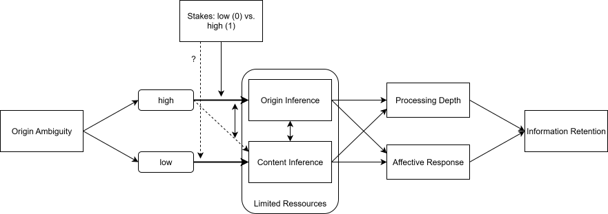

# Abstract

As firms increasingly use generative AI to produce product shoots, video ads, and news-like reels, AI-generated outputs reach near-human quality, making it difficult for viewers to distinguish whether content was created by humans or AI. We take a new perspective on this phenomenon and propose _origin ambiguity_ as a central challenge in such contemporary marketing communication. In the absence of clear regulations, consumers increasingly experience ambiguity related to content origin and pose the question "is this AI or real?".
We ask: what changes when people no longer know if what they are looking at has been generated by a human or by AI? To the best of our knowledge, this question remains unanswered. 
Existing work suggests that ambiguity is a relevant phenomenon with potentially detrimental effects. Specifically, ambiguity might shift attention away from _content deliberation_ toward deliberation about _origin_, if consumers are motivated enough to engage in deeper processing (e.g., under high involvement), with implications for marketing persuasiveness, informed decision-making, and affective responses (amongst others).

# Related theory and phenomenon-in-context
## AI and Human Origin
Much research has studied the consequences of explicit human vs. AI origin under the phenomena of algorithm aversion and appreciation (e.g., @bigmanAlgorithmicDiscriminationCauses2022). Here, consumers know and/or are informed about the origin of a recommendation, post, or product, and seem to prefer human over AI or vice versa conditional on various factors. 
Other research demonstrates that people are generally bad at identifying the origin of content (AI or human) (e.g., @vukojicicImitationDrawingCan2023; @porterAIgeneratedPoetryIndistinguishable2024a; @milickaHumansCanLearn2025).

This latter research points at a human-AI generation frontier that is increasingly blurred. As a case in point, multiple forums exist around the question "Is this AI or real/human" ([r/RealOrAI](https://www.reddit.com/r/RealOrAI/)), and the comment sections on social media pages are filled with consumers eager to know if what they are looking at is "real" or AI-generated. Importantly, there is no legally mandated disclosure of AI involvement in content generation, resulting in many situations where the origin remains ambiguous.

## Ambiguity in Marketing

Ambiguity in marketing (e.g. surprise boxes) has been shown to affect attention and raise interest, but also result in aversion, especially in high-stakes situations [@kovachevaUncertaintyMarketingTactics2024]. 
For example, when product quality is ambiguous, consumers rely more on ads [@hochConsumerLearningAdvertising1986], and on top-down approaches (i.e. expectations, theories, @yiDeterminantsConsumerSatisfaction1993); and ambiguity aversion correlates with a preference for established products [@muthukrishnanAmbiguityAversionPreference2009; @hochConsumerLearningAdvertising1986]. Furthermore, research on a distinct, but related phenomenon -- the uncanny valley [@moriUncannyValleyField2012] -- gives preliminary evidence that ambiguous stimuli tax cognitive resources [@shinUncannyValleyNo2019; @taoExploringPersonaCharacteristics2022; @howardInvestigatingSimulationElements2017].

One important moderator for the occurrence of ambiguity effects in general are the stakes of a situation and the resulting motivation of consumers to resolve ambiguity. Marketing tactics strategically using obfuscated materials (i.e. cropping objects, incomplete typefaces, ...) show that consumers attempt to resolve these introduced ambiguities only when they are motivated to do so [@joharConsumerInvolvementDeception1995; @peracchioHowAmbiguousCropped1994 @hagtvedtImpactIncompleteTypeface2011]. We expect that comparable effects occur under origin ambiguity. 

# Relevance
## Theoretical

This phenomenon integrates several streams of research that to the best of our knowledge have been treated separately so far: research on ambiguity in marketing, on cognitive load theory, and on consumer exposure and reactions to AI-generated content. Extending prior work on AI where origin is known or the variable in question, we study cases where humans face content that is neither declared AI or human or easily determined as one or the other.

## Practical

*Origin ambiguity* holds implications for both marketers and consumers: For marketers, potential backfiring of AI generated ads as well as the resulting trade-offs with efficiency and effectiveness are relevant. For consumers, cognitive resource reallocation might come at the cost of informed decision-making. 

# Research Plan
Based on the existing literature, we suggest that when people are no longer sure if something has been generated by a human or by AI, they try to resolve this ambiguity. One possible strategy here is more elaboration on the origin and less deliberation on the content resulting in worsened information retention. Additionally or alternatively, we suggest that the ambiguity leads to a negative affective response.
Evidenced by previous research, we suggest that people only attempt to resolve ambiguity when they have sufficient motivation to do so, in other words when the stakes are high enough. 

{#fig-conceptual-model}

# Open Questions
- Is this relevant and theoretically interesting enough in your eyes?
- We mainly believe the IV (origin ambiguity) is interesting to study. We're less confident that what we propose downstream in terms of the ambiguity resolve strategy (cognitive resources allocated to origin vs content) is the best option available. Maybe you have other ideas what to look at?
- Methodically, one crucial question pertains to the operationalization of the IV. Put simply, people may simply not think about origin without a prompt to do so. Specifically, we were wondering how we can test an origin ambiguity IV *as it is naturally occuring* as opposed to pointing participants to the ambiguity of some content (which is then a confound).
- A second question to be discussed is whether or not to include the comparison of low origin-ambiguity materials that are clearly AI generated, or if it makes more sense to only compare against clearly human-generated material. (we'd probably need to do so at some point)