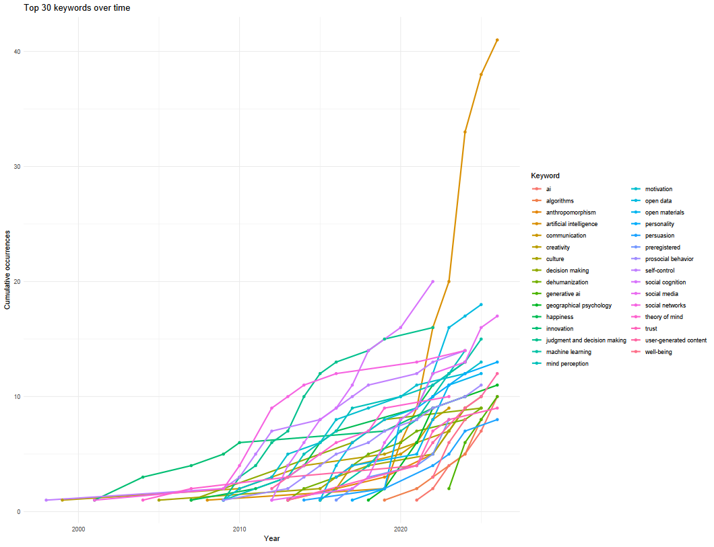
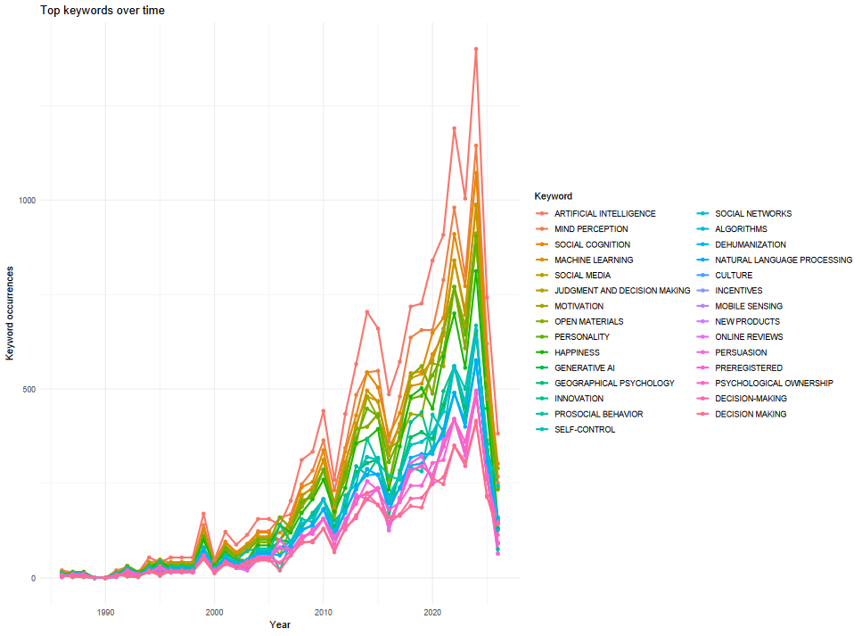
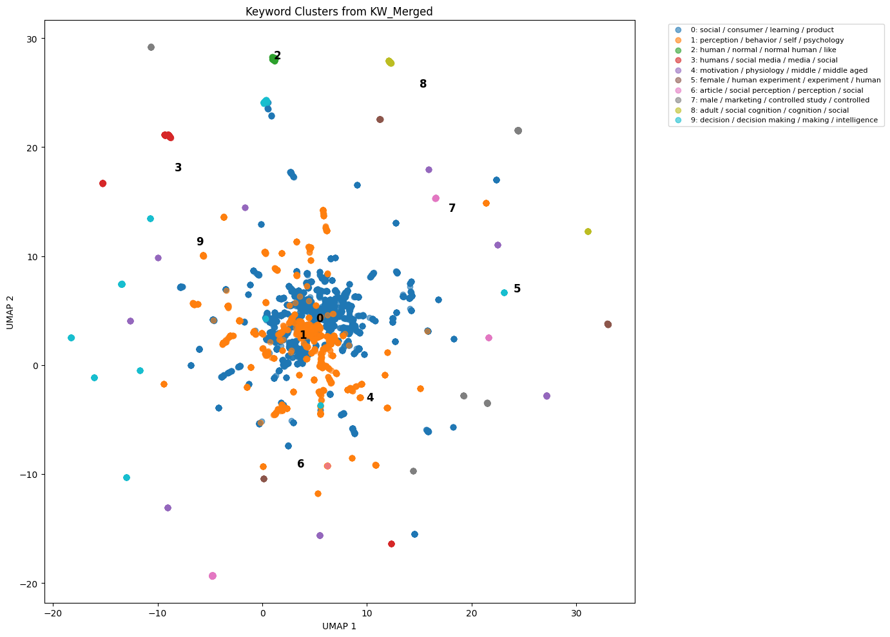
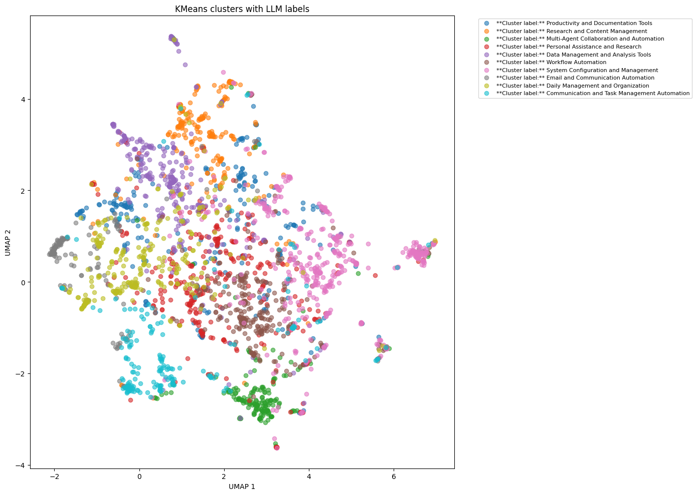

# Overview

On 24th to 26th of June, 2026, we will hold the Consumers + Technology Dialogue in Zermatt. This unique opportunity allows us to bring together a group of experts in the domain of consumer-technology interaction. The two days will be centered around the **state of our field in the past and present**, as well as the **future of our field**. To facilitate a discussion and frame the entire event, we want to create a **map of the field** that analyzes and visualizes the state of research up to now, and the connections between the different areas of research.

Additionally, this map of the field could offer an interesting perspective to be published in the *Current Opinion in Psychology* special issue lead by Emanuel, Anne and Ana on the topic of **Humans and Technology**.

This document is a collection of experimentation and notes, combined with any open questions that need to be adressed to adequately plan the scope and content of the project "Consumers + Technology: A landscape of our Research Field (so far)" (working title).

## Goal of the Project

The goal of this project is to have a comprehensive overview over the themes, theories, and connections (both thematic as well as interpersonal) of the field. In doing so, we want to provide a framing of what our field has done so far, and give a perspective of where it might go in the future. However, many of the specifics and details are unclear and yet to be defined. Therefore, this document provides a list of options which could lead us towards a Consumers + Technology Map of the Field.

::: {.callout-note title="Open Questions"}
-   To what extent does this project involve active contribution *during* the CTD? Will it be more of an input, or will it be an interactive, growing part of the conference?
-   Is writing a paper out of this project a given, or an option?
-   To what extent do we want to disentangle subject matter and methodologies? Both seem to be of interest in the community, at least according to the survey answers we got
:::

There are several moving parts on which we need to make decisions, which will be discussed in more detail below. The current decision tree denotes options Emanuel and I saw as probably reasonable (still up to discussion!!) in green, and options we see as less optimal in orange.

```{mermaid}
%%| echo: false
flowchart TD

subgraph Q1[Overarching Goal]
    A11[<b>CTD specific:</b><br>We want to have a taxonomy tailored to the CTD conference]
    A12[<b>Field-encompassing:</b><br>We want to have a taxonomy of the field of consumers+technology research]
end

subgraph Q2[Sampling Strategy?]
A21[Full texts]
A22[Abstracts + Keywords]
end

subgraph Q3[Sample Inclusion and Exclusion]
A31[Keyword-based]
A32[Author-based]
end

subgraph Q4[Computational Approach]
    A41[Classical SLR]
    A42[Bibliometric analysis]
    A43[LDA/STD style]
    A44[Embedding-based]
    A45[Combined approaches]
end

A11 --> A21
A11 --> A22

A12 --> A22


A21 --> A32

A22 --> A31
A22 --> A32

A31 --> A42
A31 --> A43
A31 --> A44
A31 --> A45

A32 --> A41
A32 --> A42
A32 --> A43
A32 --> A44
A32 --> A45

style Q1 fill:#e8f4ff,stroke:#2b6cb0,stroke-width:2px
style Q2 fill:#e8f4ff,stroke:#2b6cb0,stroke-width:2px
style Q3 fill:#e8f4ff,stroke:#2b6cb0,stroke-width:2px
style Q4 fill:#e8f4ff,stroke:#2b6cb0,stroke-width:2px

style A11 fill:#fff3e0,stroke:#f97316,stroke-width:2px
style A12 fill:#eafaf1,stroke:#2f855a,stroke-width:2px
style A21 fill: #fff3e0,stroke:#f97316,stroke-width:2px
style A22 fill: #eafaf1,stroke:#2f855a,stroke-width:2px
style A31 fill:#eafaf1,stroke:#2f855a,stroke-width:2px
style A32 fill:#fff3e0,stroke:#f97316,stroke-width:2px
style A41 fill:#fff3e0,stroke:#f97316,stroke-width:2px
style A42 fill:#eafaf1,stroke:#2f855a,stroke-width:2px
style A43 fill:#eafaf1,stroke:#2f855a,stroke-width:2px
style A44 fill:#eafaf1,stroke:#2f855a,stroke-width:2px
style A45 fill:#eafaf1,stroke:#2f855a,stroke-width:2px
```

# Scope

## Sampling Strategy

::: {.callout-note title="Open Questions"}
Do we want to do a full-text analysis or an abstract-based approach?
:::

Depending on our goal, we essentially have two options when it comes to the sampling strategy:

1.  **Bibliometric approaches** using SCOPUS or Web of Science

The bibliometric approaches are limited in depth, as they generally include titles, abstracts, and keywords. However, if we assume that people will declare the key concepts of their work in the abstract, it offers an opportunity to have a very encompassing literature base, that is freely available to us through SCOPUS (and to a limited extent WoS). I have put some very preliminary examples of SCOPUS based analyses further down below.

2.  **Full-text approaches** using manual search

While full-text analysis gives more depth and profound understanding of concepts and theories and how they relate to each other, it is a limiting approach for several reasons. First, full-text availability is not guaranteed, and texts need to be searched and identified manually. This can be done for a select scope (e.g. 30-100 full texts), but not for a systematic overview of our field. Second, even if we somehow find a way to include a larger corpus of full text in our analysis, full-text analysis also needs more time (either manual, or by pre-processing text through computational approaches), which is limited for this project. Third, complex data requires complex methods, and if we want to use any form of non-local LLM (and potentially even local!) to analyze texts, we need explicit consent from all authors to not violate copyright law. Even if we assume that we get this consent, obtaining it would be a project spanning several months in itself.

## Sample Inclusion and Exclusion

::: {.callout-note title="Open Questions"}
Do we aim to primarily cover the CTD community, or do we aim to primarily cover *the field* at large?
:::

The first criteria to be defined are how to include papers in our field map.

Including a sample based on **authorship** (e.g. important people from the CTD community) would set our sample at \~1000 papers (I have done a preliminary analysis on Scopus with all attending guests of CTD26 and come to 891 papers). Including additional papers that cite these core papers expands the number to approximately 40'000 (35'876 in the preliminary analysis).

Including a sample based on **keywords** increases this number exponentially: the search string "TITLE, ABSTRACT, KEYWORD = {human\* AND technology}" leads to 980'000 search results, "TITLE, ABSTRACT, KEYWORD = {human\* AND technology AND interact\*}" to 11'850. Replacing "human" with "Consumers" yields similar results.

Regardless of the exact method through which we arrive at a map of the field, the two sampling strategies offer several advantages and disadvantages:

| Sampling Strategy | **Advantages** | **Disadvantages** |
|------------------------|------------------------|------------------------|
| Authorship | \- clear tie into conference and highly relevant to the discussions <br> - manageable sample even if full-text screening is needed <br> - could make use of expertise by authors | \- scientific merit / justification? <br> - bias <br> - will miss some topics because noone covers that niche <br> - does not conform to the current publication standard for any type of Systematic Literature Analysis |
| Keywords | \- scoping very broad <br> - scientifically easier to justify (why these keywords) <br> - niche topics not on our radar could be identified | \- ginormous amount of data (could also be an advantage!) <br> - who decides the right keywords <br> - relevance to CTD not guaranteed upfront |

: Advantages and disadvantages of sampling strategies {tbl-colwidths="\[20,40,40\]" .striped .hover}

::: {.callout-tip collapse="true" title="Sabou's additional Thoughts"}
In my personal estimation, I think using an authorship-based inclusion would give us a very nice tie in to CTD. We could include all the "neat" things such as:

-   highlighting the senior members at CTD and their expertise and influence (Jacob, Bernd, Carey among others are very highly cited)
-   strategically highlight the invited participants that will give pitches on Thursday (and Friday? exact program tbd) on a content map and show how their expertise has shaped the discussions on that topic so far
-   get some historical datapoints on the development of our field
-   make members of CTD feel valued

However, I am worried that going with an authorship based approach could cause issues down the line, that we then have a really neat content map of the CTD community, but not really "consumers and technology". Of course, some patterns will repeat, but it is unclear to me what breadth "our" community really covers.

Analyzing a specific subsample of the CTD community within the field at large would of course be another, alternative option, that would combine the best of both worlds.
:::

## Computational Approach

Creating a "map of the field" can assume several ways, that vary in scope, interpretability, and feasibility. The table below summarizes the approaches I see viable. I already tested out some approaches and have summarized more detailed insights further down below.

### Overview

| Approach | Description | Data scope | Advantages | Disadvantages | Estimated effort | Tools | Example | Sources |
|--------|--------|-------:|--------|--------|:------:|--------|--------|--------|
| Manual qualitative content analysis | Systematic literature review in the traditional sense | 10–100 papers | \- Human expertise and interpretation at every step<br>- Captures nuances and subtext | \- Very labor-intensive<br>- Would necessarily drastically reduce the sample size | ⭐⭐⭐ | No tools needed |  | PRISMA Scoping Review |
| Bibliometric analysis | Summarizes large quantities of bibliometric data to present the intellectual structure and emerging trends of a research topic or field. | 500–20,000 papers | \- Fully quantitative/computational, but less human effort<br>- Reproducible<br>- Established scientific method<br>- Tools are available, including R packages and visualizations | \- Based on less refined ML methods<br>- Context and nuances are hard to grasp<br>- Established tools such as Bibliometrix have certain limitations | ⭐⭐⭐ | Bibliometrix<br>VOSviewer<br>CiteSpace | \<a href="#bibliometric-analysis"\>Bibliometric analysis Example\</a\> | @donthuHowConductBibliometric2021 |
| Structured Topic Modeling | Text analysis framework that identifies hidden topics in large datasets while incorporating document-level metadata such as author, date, or source. Basically LDF with extra steps. | 500–20,000 papers | \- Fully quantitative/computational, but less human effort<br>- Reproducible<br>- Established scientific method, although not necessarily prevalent in “our” fields<br>- Tools are available through R packages and embeddings from TF-IDF, BERT, etc. | \- Based on less refined ML methods<br>- Context and nuances are hard to grasp<br>- Existing tools have certain limitations<br>- I have done LDF and BERTopic modeling, but not STM yet, so outcomes are hard to estimate | ⭐⭐⭐⭐ | `stm` R package |  | @robertsStructuralTopicModels2014 |
| Topic modeling with embedding models | Topic modeling approach that extracts coherent topic representations using class-based TF-IDF. BERTopic generates document embeddings with pre-trained transformer-based language models, clusters these embeddings, and then generates topic representations with class-based TF-IDF. | 500–20,000 papers | \- Quantitative with some human input, such as defining clusters or manually fixing certain elements<br>- Embedding-based approach allows for more nuance<br>- Well-established method | \- Dimensionality reduction can be somewhat probabilistic<br>- Data preprocessing is highly relevant<br>- Bad preprocessing can lead to bad embeddings<br>- Sometimes difficult to work with | ⭐⭐⭐⭐ | BERTopic Python packages | <a href="#bertopic-embedding-based-analysis">BERTopic / embedding-based analysis</a> | @grootendorstBERTopicNeuralTopic2022 |
| LLM-based approach | Building recurring loops with generative LLMs and specified prompts to build a database. | 10–20,000 papers | \- Human expertise and requirements can be given upfront<br>- Much more customizable<br>- Allows for some “understanding” of the content<br>- Tools are available, although they are more suited for exploration than scientific publication | \- Replicability is limited, even with temperature = 0<br>- Risk of introducing biases through biased prompting<br>- Output still needs to be treated somehow, for example through clustering | ⭐⭐⭐⭐ | Various |  | @wangPromptingLargeLanguage2023 |
| Combined approaches | Using LLMs to standardize data and then applying topic modeling, bibliometric analysis, or another quantitative approach to the outputs. | 500–20,000 papers | \- Human expertise and requirements can be given through prompts<br>- Multi-layer approaches are easier, for example distinguishing “theories” from “concepts”<br>- Relatively straightforward with API calls | \- Replicability is still problematic<br>- Somewhat iterative process that needs to be adapted based on output | ⭐⭐⭐⭐⭐ | APIs, LLMs, topic modeling tools, bibliometric tools | <a href="#combined-approaches">Combined approaches</a> | @wangPromptingLargeLanguage2023 <br>Liu et al., LLM-guided semantic-aware clustering |

: Comparison of possible methodological approaches {tbl-colwidths="\[13,20,10,22,22,8,12,13\]" .striped .hover}

### Bibliometric Analysis

I did run a quick analysis utilizing the Bibliometrix Package with R on the data of our attending conference members over the weekend. Some notes:

-   The package is extremely easy to use out of the box
-   The analysis is smooth and much of it can be used as is (e.g. citation maps), and also looks pretty cool :)
-   Unfortunately, the topic modelling is limited at best, as it primarily follows word frequency and dictionary approaches, meaning that it has a hard time capturing nuances. As an example: "Open Data" is apparently frequently used when describing our work, however this is not the subject matter of our domain, more just a tool / practice we follow. Never the less, it appears as a topic on the content map.


<!--
The content/thematic map was generated from a keyword co-occurrence network. Themes correspond to clusters of co-occurring keywords. The x-axis, relevance degree, represents the ranked centrality of each cluster, calculated from its external links to other clusters. The y-axis, development degree, represents the ranked density of each cluster, calculated from the internal links among keywords within the cluster. Thus, highly relevant themes are strongly connected to other themes, whereas highly developed themes show strong internal cohesion. 
-->



:::{.callout-warning collapse="true" title="Additional Plots"}

The following is the out-of-the-box plot coming from Bibliometrix, where counts are somehow inflated. I could not find the reason for it when inspecting the internal code, so I've made a github issue. If anyone wants to know why, happy to keep you posted :D.



:::

### BERTOPIC (Embedding-based) Analysis

I have worked a lot with embedding-based clustering and approaches, and ran a quick analysis based on the same data used above with BERTopic and a medium-sized embedding model:

-   It was an absolute bitch to get to work (as BERTopic often is) and refused to cluster adequatly until I had tinkered with it for 10+ iterations
-   This colorful personality persisted even after, as clusters are objectively not optimally distributed
-   Topic modelling in multi-dimensional spaces works pretty well, but reducing it to a 2- or 3-dimensional map is very difficult, and furthermore hard to make replicable without relying on inadequate minimalist models which then reduce the quality of the dimensionality reduction, as also evidenced in the plot below 🫠...



### Combined Approaches

I have not had time to test out a combined approach on this data, but coincidentally did so just last week for the Agentic AI project, where I clustered 10k reddit comments according to use-cases that users claim they use Agentic AI for. My thoughts:

-   I used OpenAI's 4o-mini to extract topics from open text and then ran semantic embedding clustering (BERTopic again) on it
-   With pre-processed data that went through an LLM, the clusters made more sense and were less subject to the personality of the model
-   The prompts used to generate the information needed a lot of refinement, but once I was happy with the output of the small test sample, the rest ran very smooth
-   I have only visualized the use cases in the plot below, however I added additional clusters by coding for "attributed autonomy" of OpenClaw and "perceived control" over the processes by the user through additional LLM-based prompting. Adding dimensions that require a form of "understanding" is rather easy with this approach
-   While generally being happy with the output, I am still hesitant about replicability, as even with a temperature of 0, identical models, and identical prompts, there were slight variations in the output. Because I was not able to rerun the full analysis on 10k samples several times, I cannot judge how substantial these variations are across a large sample
-   I don't love the fact that we are basically forced to use close-weights models (OpenAI, Claude, ...) because the open weight ones I can run on my hardware (computer we have at home) are not sufficient for the purposes (I can get up to 72b parameters to run, which is a lot, but nowhere near state of the art)



::: {.callout-tip collapse="true" title="Some more of Sabou's ramblings"}
An additional approach, that would however be rather risky and could only be done in combination with one of the other approaches, would be to pick up additional meta-topics also proposed by participants, and have an LLM agent do the analysis and topic modelling according to our criteria, e.g. having Claude Cowork with a set amount of credits do this. This would most likely not end in favor of the agent, but could be a cool perspective to show what can already be done with these agents and where they still fall short.
:::

# Timeline

The project falls under a rather tight timeline. Below, I have tried to illustrate what a timeline *could* look like. Regardless of the decisions we made in the steps above, it is very evident that there is very little time for data collection & analysis upfront the CTD26. One big open question (already covered in goals) is what our ultimate goal of the project is. The timeline will vary based on the goal, especially the publication-part out-back after CTD26.

```{mermaid}
%%| echo: false

gantt
    title Potential Timeline
    dateFormat  YYYY-MM-DD
    axisFormat  %d.%m.%Y

    section Preparation <br>CTD26
    Data collection           :a1, 2026-05-01, 2026-05-08
    Preliminary analysis       :a2, after a1, 2026-05-13
    Presentation in Colloqium?: milestone,m0,2026-05-13,0d
    First dissemnination: a3, after a2, 2026-05-21
    Discussion and revisions: a4, after a3, 2026-05-30
    Preparation results and presentation: a5, after a4, 2026-06-10


    section Consumers + <br>Technology Dialogue 2026
    CTD26              :b1, 2026-06-24, 2026-06-26
    Presentation     :milestone, m1, 2026-06-24, 0d

    section Preparation Manuscript
    Reanalysis based on CTD input                :c1, 2026-07-01, 10d
    Writing of manuscript          :c2, after c1, 2026-07-20
    Feedback v1 manuscript: c3, after c2, 2026-07-31
    Revision of manuscript: c4, after c3, 2026-08-14
    some more back and forth: c5, after c4, 2026-08-30
    Submission manuscript: milestone, m3, 2026-08-31,0d

    section Finalization
    Aftermath          :d1, 2026-09-1, 2026-09-30
```


```{mermaid}
graph LR

t1((metaverse))
t2((social media))
t3((internet))
t4((smartphones))
t5((AI influencer))
t6((computer))
t7((agentic AI))
t8((robot vacuums))
t9((robot lawnmower))

t1 --- t2
t1 --- t3
t1 --- t4
t1 --- t5
t1 --- t6
t2 --- t3
t2 --- t4
t2 --- t5
t3 --- t6
t3 --- t8
t3 --- t9
t4 --- t8
t4 --- t9
t3 --- t7
t7 --- t8
t7 --- t9

c1((trust))
c2((acceptance))
c3((adoption))
c4((autonomy))
c5((age))
c6(())


```