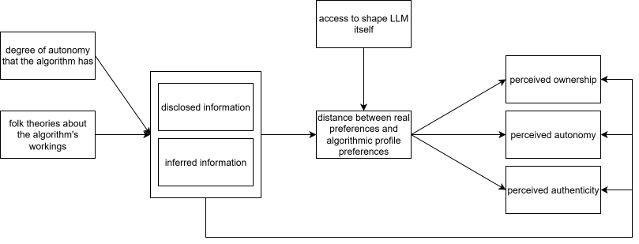

LLMs create a new environment in which people increasingly do not act directly, but delegate actions through a personalized algorithmic intermediary in the form of a chatbot, a digital assistant, or even an agentic AI[^1] acting on their behalf. This algorithmic intermediary fundamentally changes how people move and behave in digital environments. Consumers no longer interact with digital end-systems themselves, but instead instruct an LLM to do so “on their behalf.” Consumers have quickly adopted LLMs as advisors and delegates across a variety of tasks and domains [@chatterjiHowPeopleUse; @zao-sandersHowPeopleAre2025].

But how do consumers shape the “on behalf” for the LLM? LLM-mediated environments form representations of the user on several levels: consumers disclose relevant contextual information about decisions through the prompts they write, but LLMs also infer traits and preferences about the user based on their interaction behavior. Additionally, consumers are increasingly encouraged to shape the personality of the LLM itself (i.e. the "LLM personality") through system prompts and custom instructions. Together, these components influence the formation and manifestation of the algorithmic intermediary, an amalgamation of the consumer’s true traits and preferences, the LLM’s understanding of the consumer, and its constraints and instructions regarding what to make of this.

Discourse in the AI innovation space points toward increasingly unfiltered and transparent self-disclosure of traits and preferences to the LLMs consumers interact with [e.g., @ai-ascent-sequoia-2025; @zao-sandersHowPeopleAre2025]. Simultaneously, as LLMs are increasingly used as delegates rather than merely as supporters, the question arises whether consumers intend to present a representation of themselves that is as faithful as possible, or instead construct a variation of the self that is better suited to the person they (think they) ought to be for a given task.

The question therefore arises:

**When consumers delegate choice to an algorithmic intermediary, do they construct that intermediary to represent who they really are, or to compensate for perceived shortcomings of themselves or the environment—and what does that do to decision ownership, perceived autonomy, and authenticity?**

If consumers construct the intermediary to mirror their actual preferences, they should experience higher decision ownership and authenticity because the output can be interpreted as an extension of the self. Yet this may also complicate autonomy: even when choice is delegated, consumers may feel more autonomous if the intermediary is experienced as “me in algorithmic form.”

This also raises a second question: if the intermediary is constructed in ways that do not fully align with the consumer’s true preferences and traits, what follows behaviorally from that divergence?

**When consumers’ algorithmic intermediary makes suggestions or decisions that diverge from their true preferences and traits, how does this impact their behavior?**

This question matters because divergence between the intermediary and the true self may not only alter immediate perceptions, but also shape downstream behavior: consumers may override recommendations, adapt their own preferences, or gradually align themselves with the intermediary’s outputs.

Several aspects are expected to shape how consumers construct themselves for the algorithm, as well as the consequences of this. First, and naturally, the degree of autonomy the algorithm has is expected to change how consumers shape their own image. Second, consumer beliefs about the algorithm itself—mainly trust, or folk theories—are expected to shape how they construct that image in response to it. Lastly, consumers are expected to perceive a higher degree of ownership and autonomy if they actively shape their algorithmic self through disclosure, rather than being “creeped on” by the LLM through observation.

Theoretically, this research contributes to emerging work on consumer interaction with LLMs by conceptualizing the algorithmic intermediary as a distinct object of consumer construction, rather than treating algorithmic outputs as either neutral recommendations or mere reflections of inferred preference.

Empirically, the project asks how consumers construct this intermediary through disclosure, inference, and instruction, and how variation in that construction shapes perceived ownership, autonomy, authenticity, and subsequent behavior.

# Background and Relevant Literature
## How we shift to a world of Algorithmic Intermediaries
LLMs—and by extension agentic assistants—make big promises: making us more efficient, freeing up our time, and boosting productivity [@CollaborateClaudeProjects; @AgentforceAIAgent; @GeminiMakesYour2024; @EntdeckeGPT522026]. However, to do so, we as consumers must necessarily shift our workflows: we no longer search for “healthy vegetarian dinner” on Pinterest, which in turn recommends options based on its recommender algorithm trained on our past behavior and the behavior of consumers similar to us. Instead, we go to our LLM of choice and ask the same question. We no longer Google to find the best bank for a loan, where the results are tied to our location and interests based on cookies, but instead tell the LLM to find a bank suited to our needs, and we no longer type out our emails ourselves, but instead tell the LLM to “write a message to my boss asking for a raise.” What these examples, drawn from a vast collection of use cases [@chatterjiHowPeopleUse; @100-applications-usecases-2024; @zao-sandersHowPeopleAre2025], all have in common is that we as consumers no longer do the thing ourselves, but instead construct our algorithmic intermediary to do the thing on our behalf. The relevant change is therefore not only technical but behavioral: consumers must increasingly decide how to represent themselves to the system that will search, recommend, and sometimes act in their place. What changes is not merely the interface through which consumers access digital systems, but the location at which search, evaluation, and representation are performed.

This shift is gradual and influenced by several domains. Most notably, our behavior fundamentally shifts the locus of decision autonomy as well as the locus of effort: the more of the search process through decision space we delegate to the AI, the less effort we expend, but also the less autonomous we are in our choice. Taking the bank loan as an example, our research time is drastically reduced because the LLM pre-selects a group of presumably suitable lenders for us; however, this also reduces our autonomy to consider alternatives that the LLM did not deem suitable and therefore did not include in the pre-selection. This example also demonstrates that autonomy is a spectrum: while we lose some decision autonomy, we still pick one of the pre-selected options, and the LLM does not enter contractual obligations on our behalf. Looking at an agentic assistant managing our calendars [e.g., @GeminiMakesYour2024], on the other hand, both dimensions approach a more pronounced extreme: we no longer have to open our calendar app at all, and the assistant schedules our meetings on our behalf. This reduces our decision autonomy to practically zero, as we have no control over where and when appointments are booked.

While the idea of an algorithmic intermediary from the consumer’s perspective seems relatively unexplored, research on related concepts exists. @galAlgorithmicConsumers describe the concept of an algorithmic consumer, essentially an algorithmic representation of both the consumer’s interests and the marketer’s specifications that makes optimized decisions on the consumer’s behalf. This concept differs from the algorithmic intermediary on two levels: first, it operates primarily on observational data derived from massive amounts of consumer interactions with marketers; and second, it is centered on the idea that the algorithmic consumer is a collective algorithm representing the interests of many consumers, not individuals. Further, research on digital twins [e.g., @pengDigitalTwinsFunhouse2026; @toubiaDatabaseReportTwin2K5002025] in combination with LLMs taps into the representation of a person through an LLM. However, this research focuses more on applications of synthetic consumers in marketing for rapid iterative testing and deployment, and less on how consumers themselves may shape or utilize their digital twins. Unlike these concepts, the algorithmic intermediary is an individualized, partially user-constructed, and action-oriented representation that mediates between consumer and marketplace.

## The Shape of the Algorithmic Self

But how can we ensure that decisions are made in our best interest? There are essentially two components consumers can influence: the description of themselves (subsequently termed the “algorithmic self”), and the adjustment of the LLM (subsequently termed “LLM personality”[^1]). To my knowledge, no prior literature directly examines the cognitive mechanisms by which consumers decide how and when to disclose aspects of themselves to LLMs.

The algorithmic self refers to the representation of the consumer that is made available to the LLM through a combination of disclosed information, behavioral traces, and inferred traits and preferences.

### Disclosure vs. Inference

The first question is how the algorithmic self is shaped. In LLM environments, consumers have the option to actively disclose information through prompts or user.md files [@openclaw_USER] in agentic systems. Additionally, however, LLMs also infer user characteristics based on interactions and context, which are then stored to memory [@whatMemory; @HowClaudeRemembers]. This observational nature of LLMs and their subsequent adaptation to the user’s specific requirements and needs is also explicitly used as a selling point for adopting agentic assistants such as OpenClaw [@openclaw_memory]. Analytically, disclosure and inference should be distinguished because the former is experienced as agentic self-presentation, whereas the latter may be experienced as passive extraction.

Previous literature on recommender systems and the perception of being observed suggests that this constant observation could also be perceived negatively: consumers tend to exhibit aversion to the feeling of being surveilled [@ruckensteinAlgorithmsAdvertisingIntimacy2020; @zhangGoogleKnowsMe2025, among others], especially if the observations feel eerie. These phenomena map particularly onto the inferred preferences LLMs store and use to shape their recommendations and answers to consumers.

In some contexts, namely when people expect disproportionate downstream consequences, they even actively enact self-censorship to avoid those consequences. These effects are also called chilling effects [@buchiChillingEffectsDigital2022]. While chilling effects are most commonly discussed in the context of state surveillance, the underlying mechanism rests on the perception that seemingly minor or inconsequential actions (e.g., publicly criticizing healthcare systems) may lead to disproportionate downstream consequences, such as jeopardizing a student visa [@buchiChillingEffectsDigital2022]. Self-censoring responses to perceived observation are not limited to state surveillance contexts. For instance, similar effects have been documented in domains such as health-monitoring devices, where individuals adjust their behavior in light of being tracked [@demetrovicsExploringLifestylePressures2025]. The question arises to what extent consumers transfer these chilling effects to the construction of their algorithmic self: if consumers believe that LLMs may retain and later reuse unfavorable traits or disclosures, they may strategically omit, soften, or reframe those aspects when constructing their algorithmic self.

Both related phenomena—dataveillance and chilling effects—cannot be mapped directly onto LLM interactions, but they can inform hypotheses about consumer perceptions and reactions in these environments. In recommender systems literature, theories about how the companies providing the recommendations work, and what their “agenda” is, influence consumer reactions [@devitoAlgorithmsRuinEverything2017; @raderUnderstandingUserBeliefs2015; @hamExploringHowConsumers2017]. It should be expected that LLMs are no exception to this influence of folk theories.

### Mirrors vs. Compensators

The second question in how consumers shape their algorithmic selves pertains to the disclosed information they provide. While behavioral inferences made by LLMs can be assumed to mirror consumers’ actual behavior more closely, consumers more actively shape the information they provide through disclosure. The question therefore arises whether consumers try to provide an image as close to themselves as possible [as suggested by @ai-ascent-sequoia-2025, i.e. mirroring], or whether they selectively disclose or avoid disclosing information based on the anticipated reaction of the LLM.

One form of such compensation concerns the consumer’s own perceived shortcomings. In this case, consumers may disclose a version of themselves that is closer to an ideal self than to their actual self. They may not present the traits and preferences they truly have, but those they believe they ought to have in order to arrive at better decisions or outcomes. In this sense, the constructed algorithmic self would not mirror who they are, but who they would like the intermediary to act for.

A second form of compensation concerns the algorithm’s perceived shortcomings. Here, consumers may strategically shape their inputs not because they want to improve themselves, but because they believe the system will otherwise misunderstand, misweigh, or poorly process their traits and preferences. Existing literature on recommender systems and algorithmic recommendations in general raises the question of whether consumers purposefully adapt their behavior to compensate for perceived algorithmic shortcomings. @goergenAIAssessmentChanges2025, for example, demonstrate that people overstate their analytical abilities in hiring processes when they are assessed by an LLM. This suggests that while they may not perceive themselves as being truly analytical, they may construct their self in a way that compensates for the anticipated behavior of the algorithm. Other work (Anne’s unpublished study, the project group knows Anne so you can keep this) suggests that consumers state preferences that are less broad when they interact with algorithms compared to humans because they believe that algorithms cannot accurately weigh preferences.

Self-disclosure toward algorithms and LLMs is not a novel topic. However, no existing research specifically addresses the overlap of true self and constructed self as discussed in this write-up. This mirror-versus-compensator distinction is important because LLMs shape their understanding of the consumer based on inputs and behavior, which—if they deviate from true traits and preferences—reduces the fit of recommendations and decisions to the consumer’s actual preferences, which in turn can have long-term negative outcomes. Additionally, research on the influence of system autonomy on strategic self-construction is currently very limited due to the novelty of this phenomenon.

Existing research suggests that inter-individual differences in self-disclosure toward LLMs exist [@westerTheoryMindSelfPresentation2024], depending on self-presentation styles. Other research suggests that different modalities beyond inter-individual differences influence the extent of self-disclosure [@papnejaSelfdisclosureConversationalAI2025]. There is, however, limited to no experimental evidence on the accuracy of these self-disclosure profiles, and no discussion of the strategic shaping of these inputs. Research on memory profiles by @dashAlgorithmicSelfPortraitDeconstructing2026 calls into question the extent to which this purposeful disclosure and shaping of the self is even possible, as they cite 96% of memories as being derived from observation through the LLM rather than from direct user input. This statistic should be critically re-examined from the perspective of disclosed versus inferred inputs: if a consumer discloses in context that they “like things neat and organized,” and the LLM stores this to memory, the addition to memory may be done by the LLM, but it still originated in a disclosed aspect of the constructed self. As is assumed to be the case in the first dimension describing the shaping of one’s algorithmic self, it should also be assumed that folk theories about how the LLM works shape the extent to which the representation is mirrored versus shaped in a compensatory fashion. Beyond the more generalized recommender-system phenomena described above, this is also evidenced by @coxImpactChatbotsEphemeralityFraming2025.

## Facts and Folk Theories about how LLMs make Decisions
### How LLMs really make Recommendations and Decisions

<!-- (add sources here!! <- I will do this, I just have the zotero stuff not downloaded yet)-->

At a functional level, LLM recommendations are generated from the context assembled at inference time: the current prompt, recent interaction history, persistent instructions, stored memory, and any retrieved external information. These outputs are further bounded by provider-side rules and, in some environments, may also be shaped by commercial incentives.

When an LLM answers a recommendation query (e.g., “where should I go on holiday?”), it generates the answer from the context assembled for that run: the current prompt, the recent chat, persistent user instructions, and any saved memory or retrieved profile information about the user. OpenAI states that saved memories and custom instructions are used in future responses, and connected apps can add user-specific external data; by contrast, ordinary web search is provided through the model’s web-search tool, so personalization does not come from a user’s site-specific accounts or cookies unless the user has explicitly connected a data source or the system is operating in a logged-in browser session. The resulting recommendation is further bounded by provider-side rules: OpenAI’s Model Spec and usage policies impose a hierarchy in which user instructions are followed only within system and safety constraints, so disallowed content is filtered or refused even if the user requests it. Finally, outputs may reflect platform incentives rather than only user welfare: Amazon documents that “prompts” are an ad format for Sponsored Products and Sponsored Brands, meaning commercial content can be inserted into conversational recommendation environments.

In agentic systems, the decision problem shifts from “what text should be produced?” to “what sequence of actions should be executed?” OpenClaw describes this as an agent loop in which the system assembles context, queries the model, executes tools, observes results, and iterates. The action policy is conditioned by an OpenClaw-built system prompt, conversation history, tool outputs, workspace files, and persistent identity and memory files such as SOUL.md, USER.md, and MEMORY.md; these materials constrain both recommendations and actions. OpenClaw also provides web and browser tools, so the system can translate model outputs into concrete operations on external interfaces.

Consumers do not necessarily understand these mechanisms in technical terms, but instead act on informal theories of them.

### How Consumers believe LLMs make Recommendations and Decisions

Folk theories about LLMs are widespread and frequently misaligned with the systems’ actual functioning. For example, prompts such as “make no mistakes” are sometimes interpreted as mechanisms that ensure factual accuracy, reflecting the assumption that the model can be instructed into guaranteed truthfulness. Such interactions illustrate the occasionally problematic mental models consumers bring to AI-mediated systems.

Many chatbots further reinforce these interpretive frameworks by offering system-level prompts that allow users to configure the assistant’s tone, style, or “personality,” thereby fostering the impression that one can construct “one’s own” LLM with a distinctive character. Online discussions likewise reveal extensive engagement with notions of emergent personalities and the personification of LLMs, with users attributing stable traits, dispositions, or even intentions to these systems.

In digital assistant ecosystems, this logic is formalized in artifacts such as “soul.md” files, which are described as specifying the assistant’s “soul” or enduring character. Across these contexts, a common feature of folk theories surrounding AI-mediated environments is the pronounced anthropomorphization of the underlying algorithms. This tendency appears markedly stronger than in popular conceptions of more traditional recommender systems, which are typically understood in more instrumental and less personified terms.

Consumers’ reactions to algorithmic recommendations are shaped by their folk theories about how these systems operate. Rather than interpreting recommendations as outputs of statistical or mathematical models, consumers rely on intuitive, experience-based explanations of how algorithms function [@devitoAlgorithmsRuinEverything2017; @raderUnderstandingUserBeliefs2015]. These folk theories provide a cognitive framework through which algorithmic outputs are interpreted and evaluated.

Such interpretations can be situated within the Persuasion Knowledge Model (PKM) [@friestadPersuasionKnowledgeModel1994]. When consumers infer persuasive intent or strategic curation, they activate persuasion knowledge and adjust their responses accordingly, as demonstrated in the context of online behavioral advertising [@hamExploringHowConsumers2017]. Thus, algorithmic outputs are not evaluated in isolation, but filtered through pre-existing beliefs about system motives, data use, and personalization practices. Frameworks such as the PKM may therefore help explain how consumers assign certain LLMs “external motivations,” “ulterior motives,” or similar qualities, whether these are true or not.

These folk theories should shape whether consumers aim for faithful self-representation or strategic compensation, because they determine what users think the system needs, remembers, values, or misinterprets.

# The Algorithmic Intermediary

Based on this theoretical backdrop, the algorithmic intermediary is shaped by a combination of true consumer traits and preferences, how consumers selectively report and modify them for the LLM, and how this input is then taken up, processed, and revalued by the LLM itself. The algorithmic intermediary is the effective decision-making representation that emerges from the interaction between the consumer’s true preferences, their disclosed or withheld self-presentation, the system’s inferred profile of them, and the model’s own constraints and transformations. Based on this amalgamation of inputs, the algorithmic intermediary is then “sent out” to perform searches or, in the case of agentic systems, even make decisions on the consumer’s behalf. This fundamentally shifts existing ways of understanding consumer behavior in digital environments, as marketers no longer observe consumers themselves, but instead their algorithmic intermediaries. While this shift certainly has widespread implications for both marketers and consumers, the focus of the following research questions is on the consumer.

## Affective Implications of (In-)congruence

Consumers generally prefer self-congruence and self-continuity [@rifkinVarietySelfExpressionUndermines2019]. Nevertheless, they also optimize for the best outcome, which—depending on context and assumptions about how the algorithmic intermediary comes to be—may necessitate a strategic presentation of the constructed self that deviates from one’s true preferences and traits.

The implications of this spectrum of match and mismatch are addressed in research question 1:

**When consumers delegate choice to an algorithmic intermediary, do they construct that intermediary to represent who they really are, or to compensate for perceived shortcomings of themselves or the environment—and what does that do to decision ownership, perceived autonomy, and authenticity?**

A key question is where consumers locate the compensation. Do they compensate by shifting their own construction of the self, or do they instead try to adapt the LLM? One possibility is that consumers prefer to keep the self-representation relatively self-congruent while shifting compensatory adjustments to the assistant’s persona or operating style. This would allow them to preserve authenticity while still correcting for perceived moral, cognitive, or situational shortcomings. If consumers are able to make the assistant different, they may therefore prefer a more self-congruent image of themselves, while introducing ethical, moral, or other desired corrections through the assistant rather than through misrepresenting the self.

Decision ownership concerns the extent to which consumers feel that “this was my decision.” It matters beyond purchasing because LLMs increasingly do not just help people choose products; they help them choose how to act. If an LLM drafts an email to a boss, helps someone decide whether to move cities, or suggests how to handle a friendship conflict, the key question remains whether the consumer experiences the resulting action as their own decision. In the long run, low ownership may matter because it can erode self-efficacy, increase passive delegation, and blur responsibility for consequential life outcomes.

Authenticity concerns whether the mediated output still “feels like me.” This may be especially important outside purchase contexts. In many LLM uses, the issue is not simply whether the outcome was good, but whether the resulting action still felt self-expressive. This matters particularly for emails, social messages, self-descriptions, and life decisions. Someone may send a better email with AI assistance but later feel that it was polished without really being them. In the long run, repeated inauthentic mediation may create self-alienation, whereas authentic mediation may help consumers stabilize a coherent sense of self across human and AI-assisted action.

Autonomy concerns whether consumers still feel agentic despite delegation. Even if consumers willingly delegate parts of the decision process, they may still differ in whether they experience the resulting action as self-directed or externally driven. This suggests that delegation does not simply reduce autonomy in a uniform way; rather, perceived autonomy may depend on whether the algorithmic intermediary is experienced as an extension of the self or as something acting over and above it.

It is expected that responses to incongruence are mediated by at least two factors outlined above: Algorithmic folk theories, and the way the profile was formed. 

In line with the PKM [@friestadPersuasionKnowledgeModel1994], it is expected that consumers shape their understanding of a situation in accordance with their beliefs about the marketers knowledge on them, goals, and more. Resultingly, when interacting with an LLM that is known to push sponsored results (as an example), they may adapt their self-presentation accordingly. On the other hand, if the belief is that LLMs are essentially "humans" understanding their deepest needs and desires [as suggested by @ai-ascent-sequoia-2025], this may lead consumers to reconstruct a personality as closely to their true traits and preferences as possible. 

The other mediator specifically relates LLMs back to research on recommender systems: an algorithmic self shaped based on observed behavior may feel intrusive and creepy, but - compared against the disclosed aspects - may be more accurate, and therefore feel more authentic. Being "profiled" based on observation is specifically expected to increase perceived authenticity, yet lower autonomy and decision ownership because it feels intrusive. Disclosed aspects on the other side are expected to increase perceived autonomy and ownership, yet reduce felt authenticity. 

As moderating factors, I expect the degree of autonomy of a system to be of relevance: The more autonomy a system receives (i.e. the closer it is to making fully unobtrused decisions), the more the deviation from one's true preferences will occur. 

A possible boundary condition is the degree to which consumers beliefe that they can influence the algorithmic personality itself: If they can shape the LLMs behavior to compensate for traits they aspire to, but do not believe to possess themselves, they will favor that over constructing a deviating self. 

In sum, research question 1 could be addressed with the following variables: 

## Behavioral Implications of (In-)congruence

Perceptions alone are not enough. If the intermediary diverges from the true self, the key question is not only how this feels, but how consumers respond behaviorally: whether they resist, correct, comply with, or internalize the intermediary’s outputs. The behavioral implications follow directly from the theory above. If consumers experience the intermediary as sufficiently self-congruent, they may treat its outputs as self-relevant and legitimate. If, by contrast, they experience it as misaligned or externally imposed, they may be more likely to resist its outputs or revise how they construct the self for future interactions.

Resultingly, research Question 2 asks:

**When consumers’ algorithmic intermediary makes suggestions or decisions that diverge from their true preferences and traits, how does this impact their behavior?**

More specifically, are consumers more likely to overrule decisions made on their behalf, to revise the way they present themselves to the system, or to update their own preferences in response to the intermediary’s outputs?

Consumers may respond to divergence in at least three ways: they may override the intermediary’s decisions, revise the self they present to the system, or update their own preferences in the direction of the intermediary’s outputs. These responses are not equally likely across all forms of divergence. When the intermediary is experienced as more mirrored and self-congruent, its outputs may be more likely to be interpreted as self-relevant rather than externally imposed. In such cases, consumers may be more willing to incorporate those outputs into their own preference structure. By contrast, when the intermediary is experienced as strategically shaped, misaligned, or overly driven by inference, consumers may be more likely to resist its outputs or to correct the representation they provide to the system.

A corresponding expectation is therefore that the more mirrored the intermediary is, the more likely consumers are to update their own preferences in response to its outputs. The less mirrored and the more externally attributed the intermediary is, the more likely consumers are to override its decisions or strategically reconstruct the self they present to it.

The same moderators and mediators as discussed in RQ1 are expected to apply here:

# Empirical Approaches

## Survey

## Folk Theories
Participants privately report baseline preferences, then learn more about the mechanisms of the LLM they are using. They are then asked to create the profile the assistant will use for recommendations. The dependent variable is how closely that constructed profile mirrors baseline preferences versus strategically distorts them, and how this affects ownership, authenticity, and autonomy. 

## Degree of Autonomy

## Disclosure vs. inference
Participants receive recommendations from an AI assistant based on a profile that is held as constant as possible across conditions, but the source of that profile is manipulated: either the participant actively disclosed it, or the system inferred it from their prior behavior. This design tests whether active self-construction, relative to passive inference, increases perceived ownership, authenticity, and autonomy, while reducing feelings of surveillance or creepiness.

## Behavioral response to divergence from mirrored vs. compensatory intermediaries
Participants first construct an algorithmic intermediary under either mirror or compensatory framing and then receive a recommendation that is either aligned or misaligned with their baseline preferences. The main behavioral outcomes are whether they override the recommendation, revise the profile they provided, revise the assistant settings, or update their own stated preferences in the direction of the AI output. This tests whether self-congruent intermediaries are more likely to induce internalization, whereas misaligned or strategically shaped intermediaries are more likely to trigger resistance and correction.

## Repeated-interaction / longitudinal design
Participants interact with the same AI assistant across multiple decision rounds, allowing observation of how profile construction, recommendations, and behavioral reactions evolve over time. This design examines whether repeated exposure to a mirrored versus less congruent intermediary leads consumers to increasingly internalize the assistant’s outputs, revise their self-presentation, or reduce delegation after perceived misfit. It is especially useful for testing preference updating as a dynamic process rather than a one-shot response.

# Open Questions

- Scope: Shaping the algorithmic intermediary can apply to as few or as many application domains of LLMs and "agentic assistants"
- if we feel like we want to go all-in in the agentic assistants literature, we could focus on consumption environments and make the parallels to recommender systems very explicit, however I am not sure if this is too narrow or if we risk not being relevant with this anymore because these things rapidly change
- as one could think of. Do we constrain ourselves or do we try to use this generalizeability as an asset? 
- I believe that one distinction that is not clear enough yet is the argumentation to separate LLMs as personal advisors / therapists and companions versus as utility machines that do something on the consumers behalf. I expect that this is a boundary condition for the effect I describe, and that personal assistants are shaped differently than therapists. 
- the dependent variables I suggest right now are autonomy, authenticity and ownership, but I am very open to also include other ones, or only focus on one and instead focus more on behavioral outcomes as well. 
- I currently always write "traits and preferences", however I'm very happy to remove one of the two - this is just because as of right now, I don't have better words for it 

# Long-term follow up ideas 

- how do consumer theories still apply to algorithmic intermediaries, and how do we have to revise them if at all? 

# Footnotes
[^1]: This is a working term that I am not necessarily happy with, because "personality" strongly implies antromorphism. While I believe that most people do in fact anthromorphize their LLMs, I do not position myself as claiming that this is a necessary requirement for algorithmic intermediaries to be formed. 