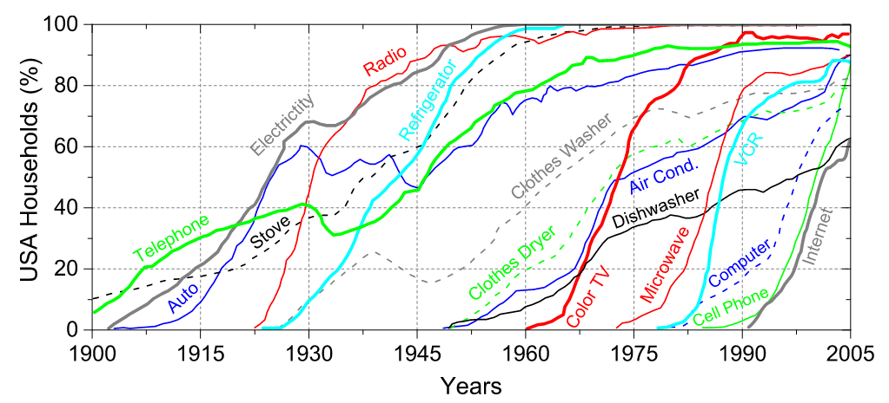
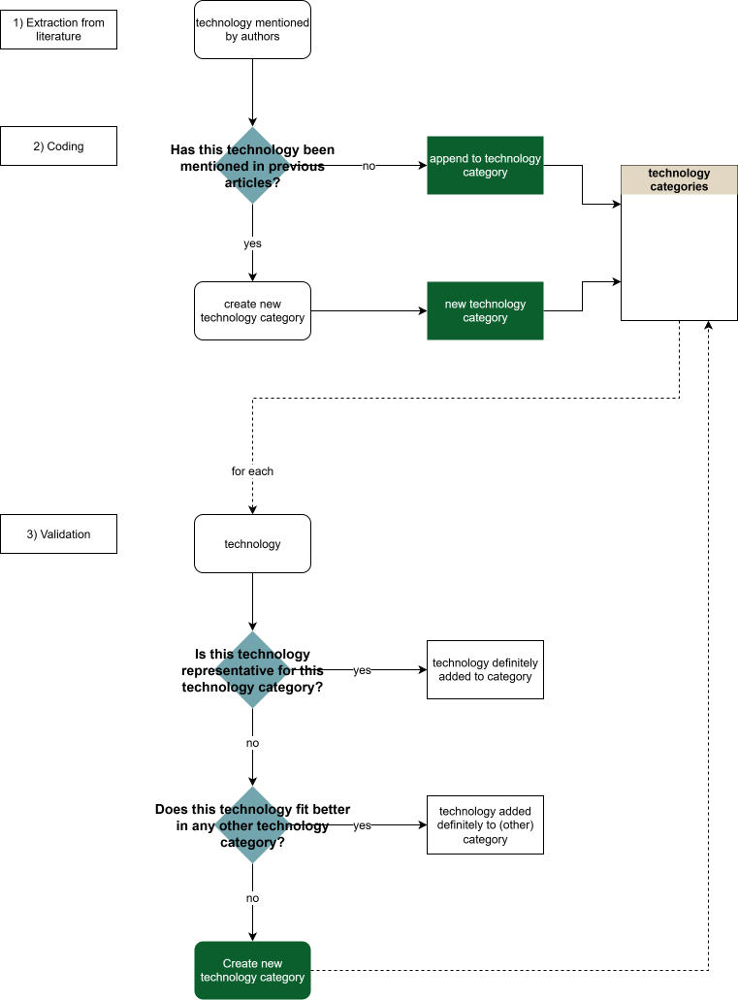

# Overview

0.  Summary
1.  Macroscopic and microscopic perspectives for adoption of technologies in the USA
2.  HATCH dataset
3.  ISIC
4.  General Purpose Technologies
5.  Own, bottom up classification

## Summary

To systematically analyze technology-related threats, we require a consistent and transparent way to classify technologies. Without a structured classification scheme, categories risk becoming arbitrary (e.g., distinguishing “smartphone” from “mobile phone”), overly granular, or inconsistently defined across studies.

While none of the approaches are optimal, they all offer different advantages and disadvantages. For more detail, each suggestion is elaborated on in further detail. The "technologies" section of options (1) through (4) offers an interactive database where you can explore the technologies listed in each suggestion.

The following five suggestions to address this classification are discussed:

**(1) Household Adoption (Carvalho et al., 2020)** 15 consumer-facing household technologies in the 20th-century USA. Empirically grounded with adoption rates, conceptually simple, but historically limited and narrow in scope. (➡️ [Details](#macroscopic-and-microscopic-perspectives-for-adoption-of-technologies-in-the-usa))

**(2) HATCH Dataset (Nemet et al., 2023)** Large-scale dataset (n = 147) covering agricultural, industrial, and consumer technologies with annual time series data up to 2022. Strong empirical grounding, but very broad, environmentally oriented, and often not consumer-focused. (➡️ [Details](#hatch-dataset))

**(3) ISIC (UN Classification System)** Internationally standardized industrial classification with hierarchical structure. Globally applicable and comparable, but classifies economic activities rather than technologies directly and may lack granularity. (➡️ [Details](#the-international-standard-industrial-classification-of-all-economic-activities-isic))

**(4) General Purpose Technologies (GPTs)** Macro-level classification based on historically transformative technologies since 1450. Comprehensive, but broad, potentially arbitrary, and difficult to operationalize at the product level. (➡️ [Details](#general-purpose-technologies))

**(5) Bottom-up Classification** Project-specific taxonomy developed inductively from the technologies relevant to the research question. Flexible, but requires more work from our side. (➡️ [Details](#bottom-up-classification))

### Summary of Advantages and Disadvantages

+--------------------------------------------------------------------+-----------------------------------------------------------------------+--------------------------------------------------------------------------------------------------------------+
| Option                                                             | Advantages                                                            | Disadvantages                                                                                                |
+====================================================================+=======================================================================+==============================================================================================================+
| **(1) Macroscopic & microscopic adoption (Carvalho et al., 2020)** | -   conceptually straightforward                                      | -   21st century not covered                                                                                 |
|                                                                    |                                                                       |                                                                                                              |
|                                                                    | -   adoption rates included                                           | -   strong focus on household technologies                                                                   |
|                                                                    |                                                                       |                                                                                                              |
|                                                                    | -   manageable number of categories                                   |                                                                                                              |
+--------------------------------------------------------------------+-----------------------------------------------------------------------+--------------------------------------------------------------------------------------------------------------+
| **(2) HATCH dataset (Nemet et al., 2023)**                         | -   very grounded in real data                                        | -   way too large                                                                                            |
|                                                                    |                                                                       |                                                                                                              |
|                                                                    | -   adoption rates (although not in population %)                     | <!-- -->                                                                                                     |
|                                                                    |                                                                       |                                                                                                              |
|                                                                    | -   wide net of technologies                                          | -   many categories do not make sense from a consumer-facing perspective                                     |
|                                                                    |                                                                       |                                                                                                              |
|                                                                    |                                                                       | -   many categories include industrial, agricultural and other technologies                                  |
|                                                                    |                                                                       |                                                                                                              |
|                                                                    |                                                                       | -   only up to 2022                                                                                          |
|                                                                    |                                                                       |                                                                                                              |
|                                                                    |                                                                       | -   limited focus on IT and software                                                                         |
+--------------------------------------------------------------------+-----------------------------------------------------------------------+--------------------------------------------------------------------------------------------------------------+
| **(3) ISIC (UN)**                                                  | -   not technology focused = applicable from consumer context         | -   not technology focused → risk of ambiguity                                                               |
|                                                                    |                                                                       |                                                                                                              |
|                                                                    | -   international relevance                                           | -   not always granular enough ("software" encompasses both CMS and AI)                                      |
|                                                                    |                                                                       |                                                                                                              |
|                                                                    | -   hierarchical structure = options for granularity                  | -   potentially very large (including all subclasses, \~800 categories)                                      |
+--------------------------------------------------------------------+-----------------------------------------------------------------------+--------------------------------------------------------------------------------------------------------------+
| **(4) General Purpose Technologies (GPTs)**                        | -   includes entire time-frame we are interested in                   | -   very broad categories make adoption "rates" hard to calculate (e.g., ICT includes phone and smartphones) |
|                                                                    |                                                                       |                                                                                                              |
|                                                                    | -   GPTs in taxonomy → GPTs in media frames (could also be a problem) | -   maybe not granular enough                                                                                |
|                                                                    |                                                                       |                                                                                                              |
|                                                                    | -   manageable amount of categories                                   | -   arbitrary decisions which GPTs we include                                                                |
+--------------------------------------------------------------------+-----------------------------------------------------------------------+--------------------------------------------------------------------------------------------------------------+
| **(5) Bottom-up classification**                                   | -   fully tailored to the project needs                               | -   researcher judgment and documentation (risk of subjectivity)                                             |
|                                                                    |                                                                       |                                                                                                              |
|                                                                    | -   granularity can be adjusted                                       | -   comparability with external work is limited                                                              |
|                                                                    |                                                                       |                                                                                                              |
|                                                                    |                                                                       | -   additional work for us                                                                                   |
+--------------------------------------------------------------------+-----------------------------------------------------------------------+--------------------------------------------------------------------------------------------------------------+

## (1) Macroscopic and microscopic Perspectives for Adoption of Technologies in the USA {#macroscopic-and-microscopic-perspectives-for-adoption-of-technologies-in-the-usa}

This classification approach is based on @carvalhoMacroscopicMicroscopicPerspectives2020, who analytically model and empirically examine the adoption of innovations by American households during the 20th century. Their empirical analysis relies on historical adoption data and a selection of technologies originally compiled in a 2008 New York Times article.

The authors analyze adoption of 15 major household technologies in the USA, focusing on adoption dynamics across the 20th century. The technologies represent consumer-facing household innovations (e.g., electricity, telephone, refrigerator, internet).



### Metadata

| Dimension                     | Scope         |
|-------------------------------|---------------|
| Time period considered        | 20th century  |
| Geographical scope considered | United States |

### Evaluation

+-------------------------------------+--------------------------------------------+
| Advantages                          | Disadvantages                              |
+=====================================+============================================+
| -   conceptually straightforward    | -   21st century not covered               |
|                                     |                                            |
| -   adoption rates included         | -   strong focus on household technologies |
|                                     |                                            |
| -   manageable number of categories |                                            |
+-------------------------------------+--------------------------------------------+

### Technologies

$n = 15$

```{r}
library(dplyr)
library(readxl)
library(stringr)
library(DT)
library(ggplot2)
library(patchwork)
library(tidyr)

tech_df <- data.frame(
  technology = c(
    "Internet",
    "Cell phone",
    "Computer",
    "VCR",
    "Microwave",
    "Color TV",
    "Dishwasher",
    "Air conditioning",
    "Clothes dryer",
    "Refrigerator",
    "Radio",
    "Auto",
    "Electricity",
    "Stove",
    "Telephone"
  ),
  stringsAsFactors = FALSE
)

DT::datatable(
    data.frame(
        Technology = tech_df$technology
    ),
    filter = "top",
    options = list(
        pageLength = 10,
        autoWidth = TRUE)
    )
```

## (2) HATCH Dataset {#hatch-dataset}

This classification approach is based on the HATCH dataset developed by @nemetDatasetAdoptionHistorical2023. The dataset compiles a wide range of agricultural, industrial, and consumer technologies adopted over the past century to better understand technology scale-up dynamics.

It provides annual time series data from the early 20th century to 2022, enabling systematic comparisons of long-run growth trajectories across technologies. While the dataset broad and diverse, it is also a very encompassing categorization that is most frequently not applicable to the consumer-facing context. Additionally, since the dataset is created from an environmental perspective, many technologies in focus are agricultural and industrial, as they are pertinent to the research questions of @nemetDatasetAdoptionHistorical2023.

### Metadata

| Dimension                     | Scope      |
|-------------------------------|------------|
| Time period considered        | up to 2022 |
| Geographical scope considered | Global     |

### Evaluation

+---------------------------------------------------+-----------------------------------------------------------------------------+
| Advantages                                        | Disadvantages                                                               |
+===================================================+=============================================================================+
| -   very grounded in real data                    | -   way too large                                                           |
|                                                   |                                                                             |
| -   adoption rates (although not in population %) | -   many categories do not make sense from a consumer-facing perspective    |
|                                                   |                                                                             |
| -   wide net of technologies                      | -   many categories include industrial, agricultural and other technologies |
|                                                   |                                                                             |
|                                                   | -   only up to 2022                                                         |
|                                                   |                                                                             |
|                                                   | -   limited focus on IT and software                                        |
+---------------------------------------------------+-----------------------------------------------------------------------------+

### Technologies

$n = 147$

```{r}
library(dplyr)
library(readxl)
library(stringr)
library(DT)
library(ggplot2)
library(patchwork)
library(tidyr)

if (file.exists("./rawdata/HATCH_1.0_Clean.csv")) {
  full_data <- read.csv("./rawdata/HATCH_1.0_Clean.csv")
} else {
  full_data <- read.csv("/rawdata/HATCH_1.0_Clean.csv")
}

hatch_technologies <- data.frame(full_data$Short.Name)

DT::datatable(
    data.frame(
        Technology = hatch_technologies$full_data.Short.Name
    ),
    filter = "top",
    options = list(
        pageLength = 10,
        autoWidth = TRUE)
    )
```

## (3) The International Standard Industrial Classification of All Economic Activities (ISIC) {#the-international-standard-industrial-classification-of-all-economic-activities-isic}

Another option for classifying technologies is to rely on the International Standard Industrial Classification of All Economic Activities (ISIC), developed by the United Nations. ISIC provides a standardized framework for categorizing economic activities into hierarchical sectors, divisions, groups, and classes.

Using ISIC to classify technologies would involve assigning each technology to the industry in which it is primarily developed, produced, or economically embedded (e.g., telecommunications, manufacturing, information services). This approach allows technologies to be grouped according to established industrial sectors rather than product-level characteristics.

### Metadata

+-------------------------------+------------------------------------------------------------------------------------------------------------------------------------+
| Dimension                     | Scope                                                                                                                              |
+===============================+====================================================================================================================================+
| Time period considered        | Contemporary classification system (current revision: ISIC Rev.4) but historically relevant and applicable (last revision in 2023) |
+-------------------------------+------------------------------------------------------------------------------------------------------------------------------------+
| Geographical scope considered | Global standard                                                                                                                    |
+-------------------------------+------------------------------------------------------------------------------------------------------------------------------------+

### Evaluation

+-------------------------------------------------------------+-------------------------------------------------------------------------+
| Advantages                                                  | Disadvantages                                                           |
+=============================================================+=========================================================================+
| -   not technology focused → risk of ambiguity              | -   not always granular enough ("software" encompasses both CMS and AI) |
|                                                             |                                                                         |
| -   international relevance                                 |                                                                         |
|                                                             |                                                                         |
| -   not too tech-focused = applicable from consumer context |                                                                         |
|                                                             |                                                                         |
| -   hierarchical structure = options for granularity        |                                                                         |
+-------------------------------------------------------------+-------------------------------------------------------------------------+

### Technologies
$n_{min} = 22, n_{max} = 830$

*Filter for "Level 1" to see the overarching levels ($n = 22$), or lower levels to see more granular perspectives. Filters must be typed in the text box above the column.*

```{r}
library(DT)

if (file.exists("./rawdata/ISIC_Rev_5_english_structure.csv")) {
  isic <- read.csv2("./rawdata/ISIC_Rev_5_english_structure.csv",row.names = NULL,check.names = FALSE)
} else {
  isic <- read.csv2("/rawdata/ISIC_Rev_5_english_structure.csv",row.names = NULL,check.names = FALSE)
}

isic <- as.data.frame(isic)

isic <- isic %>% mutate(
    Level2 = case_when(
      nchar(Index) == 1  ~ "Level 1",
      nchar(Index) == 3  ~ "Level 2",
      nchar(Index) == 4 ~ "Level 3",
      nchar(Index) == 5 ~ "Level 4",
      TRUE ~ NA_character_))


DT::datatable(
    data.frame(
        Level = isic$Level2,
        Technology = isic$Title,
        `Technology One Level Higher` = isic$`Higher Level`
    ),
    filter = "top",
    options = list(
        pageLength = 10,
        autoWidth = TRUE)
    )

```

## (4) General Purpose Technologies {#general-purpose-technologies}

A further option is to classify technologies based on the concept of General Purpose Technologies (GPTs). Artificial intelligence is frequently discussed as a contemporary GPT [e.g. @calvinoGenerativeAIGeneral2025], and earlier GPTs are documented by @lipseyEconomicTransformationsGeneral2005, who identify major transformative technologies since 1450. Using GPTs as a classification approach would mean grouping technologies according to more macro-level economic and societal impact rather than at a product-level.

### Metadata

| Dimension                     | Scope                 |
|-------------------------------|-----------------------|
| Time period considered        | since 1450 up to 2025 |
| Geographical scope considered | Global                |

### Evaluation

+-----------------------------------------------------------------------------------+------------------------------------------------------------------------------------------------------------------------------------------------------------------------------------------------+
| Advantages                                                                        | Disadvantages                                                                                                                                                                                  |
+===================================================================================+================================================================================================================================================================================================+
| -   includes entire time-frame we are interested in                               | -   very broad categories make adoption "rates" hard to calculate: e.g. "information and communication technology" would include the phone, as well as smartphones - which one do we take now? |
|                                                                                   |                                                                                                                                                                                                |
| -   GPTs in taxonomy $\rightarrow$ GPTs in media frames (could also be a problem) | -   Maybe not granular enough                                                                                                                                                                  |
|                                                                                   |                                                                                                                                                                                                |
| -   manageable amount of categories                                               | -   Arbitrary decisions which GPTs we include: many people claim various things as GPTs (see also suggestion below)                                                                            |
+-----------------------------------------------------------------------------------+------------------------------------------------------------------------------------------------------------------------------------------------------------------------------------------------+

### Technologies
$n \approx 15$

```{r}
technologies <- data.frame(
  Technology = c(
    "Steam engine",
    "Electricity",
    "Railroads",
    "Factory system",
    "Information and communication technology (ICT)",
    "Computer",
    "Semiconductors / microelectronics",
    "Internet",
    "Artificial intelligence (AI)",
    "Three-masted sailing ship",
    "Printing press",
    "Chemical engineering",
    "Nanotechnology",
    "Blockchain"
  ),
  Sources = c(
    "Lipsey, Carlaw and Bekar (2005); Bresnahan (2010); Rosenberg and Trajtenberg (2004); Crafts (2004)",
    "Lipsey, Carlaw and Bekar (2005); David (1990); Bresnahan (2010); Jovanovic and Rousseau (2005); Moser and Nicholas (2004); Ristuccia and Solomou (2014)",
    "Lipsey, Carlaw and Bekar (2005)",
    "Lipsey, Carlaw and Bekar (2005)",
    "Lipsey, Carlaw and Bekar (2005); Liao et al. (2016); Basu et al. (2003); Basu and Fernald (2007); Cardona, Kretschmer and Strobel (2013); Jovanovic and Rousseau (2005)",
    "David (1990)",
    "Bresnahan and Trajtenberg (1995)",
    "Agrawal, Gans and Goldfarb (2023); Naughton (2016); Clarke, Qiang and Xu (2015)",
    "Agrawal, Gans and Goldfarb (2023); Cockburn, Henderson and Stern (2019); Brynjolfsson, Rock and Syverson (2019); Crafts (2021); Klinger, Mateos-Garcia and Stathoulopoulos (2018)",
    "Bekar, Carlaw and Lipsey (2017)",
    "Bekar, Carlaw and Lipsey (2017)",
    "Rosenberg (1998)",
    "Youtie, Iacopetta and Graham (2007); Shea, Grinde and Elmslie (2011)",
    "Kane (2017); Filippova (2019); Catalini and Gans (2020)"
  ),
  stringsAsFactors = FALSE
)

DT::datatable(
    data.frame(
        GPT = technologies$Technology,
        Source = technologies$Sources
    ),
    filter = "top",
    options = list(
        pageLength = 10,
        autoWidth = TRUE)
    )
```

## (5) Bottom-up classification {#bottom-up-classification}

If none of the options above (or a combination thereof) fulfill the requirements we have to classify technologies, we might have to come up with our own, pragmatic, classification schema.

### Procedure

The following diagram displays a suggested procedure that could be employed. Decisions re: validation are made on a consensus-basis.



## Bibliography