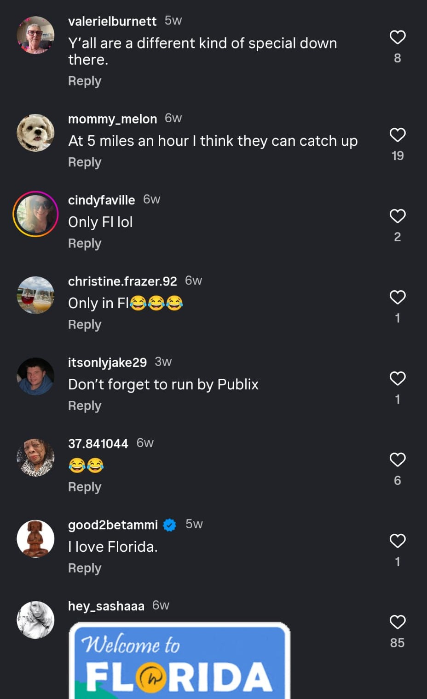
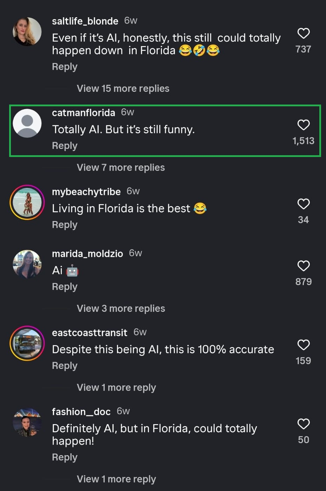
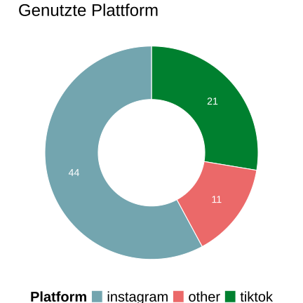
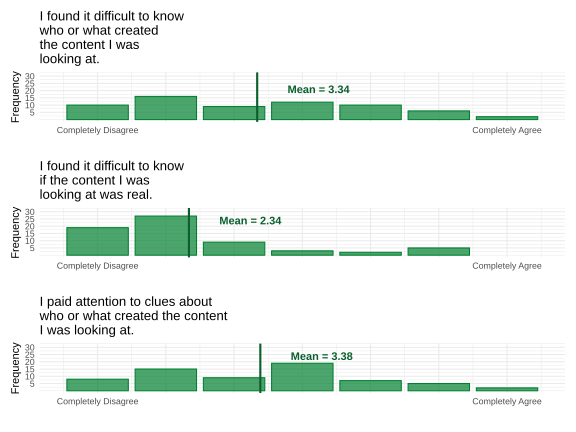

```{r}
## data preparation

library(dplyr)
library(readxl)
library(stringr)
library(DT)
library(ggplot2)
library(patchwork)
library(tidyr)

if (file.exists("./rawdata/ESF_full_responses.xlsx")) {
  full_data <- read_xlsx("./rawdata/ESF_full_responses.xlsx")
  partial_data <- read_xlsx("./rawdata/ESF_partial_responses.xlsx")
} else {
  full_data <- read_xlsx("/rawdata/ESF_full_responses.xlsx")
  partial_data <- read_xlsx("/rawdata/ESF_partial_responses.xlsx")
}

data <- rbind(full_data, partial_data)[-1,]

data$StartDate <- as.numeric(data$StartDate)
data$EndDate <- as.numeric(data$EndDate)
data$Progress <- as.numeric(data$Progress)
data$Finished <- as.numeric(data$Finished)
data <- data %>%
    mutate(platforms_behavior_tiktok =
           if_else(str_detect(platforms_behavior, "1"), 1L, 0L)) %>%
    mutate(platforms_behavior_instagram =
           if_else(str_detect(platforms_behavior, "2"), 1L, 0L)) %>%
    mutate(platforms_behavior_other =
           if_else(str_detect(platforms_behavior, "3"), 1L, 0L)) %>%
    mutate(across(recall_selfreport_1:aid_specific_3, as.numeric)) %>%
    mutate(x1_modality = as.numeric(x1_modality)) %>%
    mutate(x1_type = as.numeric(x1_type)) %>%
    mutate(x1_certainty_1 = as.numeric(x1_certainty_1)) %>%
    mutate(x1_involved_1 = as.numeric(x1_involved_1)) %>%
    mutate(x2_modality = as.numeric(x2_modality)) %>%
    mutate(x2_type = as.numeric(x2_type)) %>%
    mutate(x2_certainty_1 = as.numeric(x2_certainty_1)) %>%
    mutate(x2_involved_1 = as.numeric(x2_involved_1)) %>%
    mutate(x3_modality = as.numeric(x3_modality)) %>%
    mutate(x3_type = as.numeric(x3_type)) %>%
    mutate(x3_certainty_1 = as.numeric(x3_certainty_1)) %>%
    mutate(x3_involved_1 = as.numeric(x3_involved_1)) %>%
    mutate(relevance_personal = as.numeric(relevance_personal)) %>%
    mutate(use_AI = as.numeric(use_AI)) %>%
    mutate(use_SM = as.numeric(use_SM)) %>% 
    mutate(shop_online = as.numeric(shop_online)) %>%
    mutate(age = as.numeric(age)) %>%
    mutate(gender = as.numeric(gender)) %>%
    mutate(gender = case_when(
        gender == 1 ~ "male",
        gender == 2 ~ "female",
        gender == 3 ~ "non-binary",
        gender == 4 ~ "do not want to say",
        gender == 5 ~ "other",
        TRUE ~ NA_character_)) %>%
    mutate(x1_reaction_content_attention = 
           if_else(str_detect(x1_reaction_content, "1"), 1L, 0L)) %>%
    mutate(x1_reaction_content_contentfocus = 
           if_else(str_detect(x1_reaction_content, "2"), 1L, 0L)) %>%
    mutate(x1_reaction_content_information_comments = 
           if_else(str_detect(x1_reaction_content, "3"), 1L, 0L)) %>%
    mutate(x1_reaction_content_information_else = 
           if_else(str_detect(x1_reaction_content, "4"), 1L, 0L)) %>%
    mutate(x1_reaction_content_ignore = 
           if_else(str_detect(x1_reaction_content, "5"), 1L, 0L)) %>%
    mutate(x1_reaction_content_save = 
           if_else(str_detect(x1_reaction_content, "5"), 1L, 0L)) %>%
    mutate(x1_reaction_content_click = 
           if_else(str_detect(x1_reaction_content, "6"), 1L, 0L)) %>%
    mutate(x2_reaction_content_attention = 
           if_else(str_detect(x2_reaction_content, "1"), 1L, 0L)) %>%
    mutate(x2_reaction_content_contentfocus = 
           if_else(str_detect(x2_reaction_content, "2"), 1L, 0L)) %>%
    mutate(x2_reaction_content_information_comments = 
           if_else(str_detect(x2_reaction_content, "3"), 1L, 0L)) %>%
    mutate(x2_reaction_content_information_else = 
           if_else(str_detect(x2_reaction_content, "4"), 1L, 0L)) %>%
    mutate(x2_reaction_content_ignore = 
           if_else(str_detect(x2_reaction_content, "5"), 1L, 0L)) %>%
    mutate(x2_reaction_content_save = 
           if_else(str_detect(x2_reaction_content, "5"), 1L, 0L)) %>%
    mutate(x2_reaction_content_click = 
           if_else(str_detect(x2_reaction_content, "6"), 1L, 0L)) %>%
    mutate(x3_reaction_content_attention = 
           if_else(str_detect(x3_reaction_content, "1"), 1L, 0L)) %>%
    mutate(x3_reaction_content_contentfocus = 
           if_else(str_detect(x3_reaction_content, "2"), 1L, 0L)) %>%
    mutate(x3_reaction_content_information_comments = 
           if_else(str_detect(x3_reaction_content, "3"), 1L, 0L)) %>%
    mutate(x3_reaction_content_information_else = 
           if_else(str_detect(x3_reaction_content, "4"), 1L, 0L)) %>%
    mutate(x3_reaction_content_ignore = 
           if_else(str_detect(x3_reaction_content, "5"), 1L, 0L)) %>%
    mutate(x3_reaction_content_save = 
           if_else(str_detect(x3_reaction_content, "5"), 1L, 0L)) %>%
    mutate(x3_reaction_content_click = 
           if_else(str_detect(x3_reaction_content, "6"), 1L, 0L)) %>%
    filter(str_detect(DistributionChannel, "anonymous")) %>%
    filter(StartDate > 46003.47)
```

## Über mich

brauche ich eine Slide über mich? Ich habe nur 10 Minuten

## Über das Projekt

::: {.r-stack}
{height="500"}

{.fragment width="350"}

{.fragment width="350"}
:::

:::{.source-p-blue}
Quelle: [RealstrangeAI](https://www.instagram.com/reel/DP998AIjUqS/?utm_source=ig_web_copy_link) 
:::

## Über das Projekt 

[user Stats: realorai]

:::{.red-slide-bg}
## Hypothesen
<br>

:::{.white-text-p}
**H1:** Personen hinterfragen, ob Content von Menschen, oder von KI generiert wurde. 

**H2:** Wenn Personen nicht mehr sicher sind, ob Content von einem Menschen oder KI generiert wurde, achten sie mehr auf Kontext-Informationen, und weniger auf den Inhalt des Content.
:::

:::

## Zusammenfassung: Resultate 

- Teilnehmende: $n = `r nrow(data)`$
  - aus der Vorlesung: $n = `r sum(data$participation == "2.0", na.rm = TRUE)`$
  - von zu Hause: $n = `r sum(data$participation == "1.0", na.rm = TRUE)`$
- Erhebungszeitraum: 12. Dezember - 15. Dezember

## Plattformen

:::{.columns}

::::{.column width=40%}

::::

::::{.column width=60%}
- $n_\text{TikTok} = 21$
- $n_\text{Instagram} = 44$
- $n_\text{other} = 11$
::::
:::

## Was geht Ihnen durch den Kopf, wenn Sie Social Media scrollen?

:::{.panel-tabset}
### Word-Clouds
- [add word cloud]

### Topic Modelling
- tba wenn Zeit und funktioniert

### Alle Antworten 
```{r}
DT::datatable(
    data.frame(
        Considerations = data$considerations_open[!is.na(data$considerations_open)],
        TikTok = data$platforms_behavior_tiktok[!is.na(data$considerations_open)],
        Instagram = data$platforms_behavior_instagram[!is.na(data$considerations_open)],
        Other = data$platforms_behavior_other[!is.na(data$considerations_open)]
    ),
    filter = "top",
    options = list(
        pageLength = 10,
        autoWidth = TRUE)
    )

```

:::

## Denken Sie darüber nach, wie Content erstellt wurde? 

:::{.panel-tabset}
### Word-Clouds

### Topic Modelling

### Alle Antworten 
```{r}
DT::datatable(
   data.frame(
        Evaluations = data$evaluation_open[!is.na(data$evaluation_open)],
        TikTok = data$platforms_behavior_tiktok[!is.na(data$evaluation_open)],
        Instagram = data$platforms_behavior_instagram[!is.na(data$evaluation_open)],
        Other = data$platforms_behavior_other[!is.na(data$evaluation_open)]
    ),
    filter = "top",
    options = list(
        pageLength = 10,
        autoWidth = TRUE)
    )
```

:::

## Das Phänomen *Origin Ambiguity*

