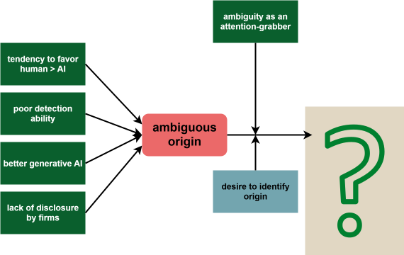
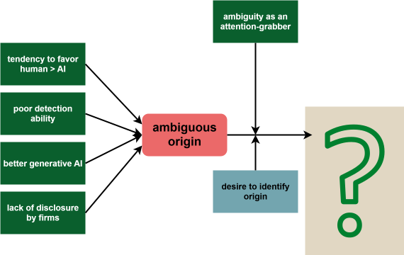
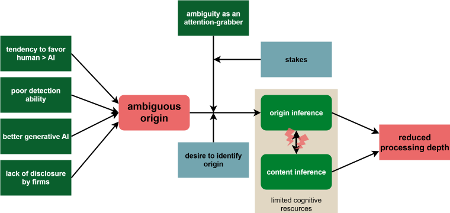
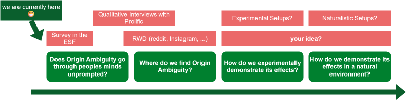

## Agenda

### (1) Origin Ambiguity 
:::{.rightalign-p}
<i class="fa-regular fa-clock"></i> ~ 45-60 min
:::

- Phenomenon & Context
- Downstream Effects
- Intended Contribution & Operationalization

### (2) Open Science Office
:::{.rightalign-p}
<i class="fa-regular fa-clock"></i> ~ 15 min
:::

- Open Science says hi (will be changed)

:::{.notes}

- ask first: do we have any admin things to discuss today? I will adapt my timeline accordingly
- up to 60 minutes für origin ambiguity

:::

:::{.section-header-bg}
# Origin Ambiguity
:::{.authors-p}
Sabou Rani Stocker, Jonas Görgen, Emanuel de Bellis & Anne-Kathrin Klesse
:::
:::

##

::: {.r-stack}
{height="500"}

{.fragment width="350"}

{.fragment width="350"}
:::

:::{.source-p-blue}
source: [RealstrangeAI](https://www.instagram.com/reel/DP998AIjUqS/?utm_source=ig_web_copy_link) 
:::

##

::: {.r-stack}
{height="500"}

{.fragment width="500"}

:::

:::{.source-p-blue}
source: [Tagesanzeiger](https://www.tagesanzeiger.ch/sbb-werben-mit-ki-bild-fotografen-kritisieren-winterkampagne-660469800566) 
:::

##

::: {.r-stack}
{height="500"}

{.fragment width="900"}

:::

:::{.source-p-blue}
source: [Vodaphone](https://www.tiktok.com/@vodafonedeutschland/video/7543534062514818326) 
:::

:::{.blue-slide-bg}
## Today's Goal 

1. What are the **downstream consequences** of origin ambiguity?
2. How can we **effectively measure** origin ambiguity & its consequences in experimental setups and the real world?

:::

## Origin Ambiguity

*Working Definition:* 

> **Origin Ambiguity**: The blurring of provenance that occurs when AI-generated content resemble human-created content so closely that people struggle to tell who (or what) made them.

:::{.notes}

> **Origin Inference**: A cognitive shift in which people prioritize identifying the source of a work (human or AI) over engaging with its meaning, quality, or message.

- so what are we talking about? 
- people perceive some sort of origin ambiguity, which leads to engaging with the question *who* did this more than engaging with the question *what* was done
:::

## Origin Ambiguity
### People want to know the difference between AI- and human-generated content, but few feel confident they can.{.smaller}

:::{.fragment .fade-in-then-out}

![Survey of US adults in 2025 conducted by Pew Research Center [@fuentesMostAmericansThink2025]](../images/pewresearch.png){style="position:absolute; top:20%; right:20%; width:60%;"}

:::

:::{.fragment .fade-in}
- participants are about as good as chance [@vukojicicImitationDrawingCan2023] identifying AI-generated images
- and slightly worse than chance [@porterAIgeneratedPoetryIndistinguishable2024] to slightly above chance with training at identifying text [@milickaHumansCanLearn2025]
:::

:::{.notes}

- mention quote explicitly: *almost 50% of respondents can distinguish between AI and human** generated artwork.
- 

- "**almost 50% of respondents can distinguish between AI and human** generated artwork." [@vukojicicImitationDrawingCan2023]
- "participants **performed below chance levels** in identifying AI-generated poems (46.6% accuracy)" [@porterAIgeneratedPoetryIndistinguishable2024a]
- "participants were more likely to judge AI-generated poems as human-authored than actual human-authored poems" [@porterAIgeneratedPoetryIndistinguishable2024a]
- With training, participants were able to correctly **identify AI generated text correctly 65% of the time**; without training 55% [@milickaHumansCanLearn2025]
:::

:::{.quote-slide-bg}
##
Today's AI is the worst AI you will ever use.

:::{.source-p}
[@mollickTodaysAIWorst2024]Mollick, 2024
:::
:::

:::{.notes}
**Ethan Mollick**: https://mgmt.wharton.upenn.edu/profile/emollick/ His academic research has been published in leading journals, and his work on AI is widely applied, leading him to be named one of TIME Magazine’s Most Influential People in Artificial Intelligence. Ethan also writes to a wider audience about AI, including in his book, Co-Intelligence, which was a New York Times bestseller and a best book of the year from The Economist and Financial Times.
:::

## Theoretical Background
### Preferences
- humans $>$ algorithms / "AI" [@bigmanAlgorithmicDiscriminationCauses2022;@kirkAIauthorshipEffectUnderstanding2025;@lefkeliSharingInformationAI2024, and others]
- AI-generated content lowers purchase intentions and willingness to recommend a product [@kirkAIauthorshipEffectUnderstanding2025; @belancheCustomerReactionsGenerative2025, and others]
- AI-generated content decreases trust [@kirkAIauthorshipEffectUnderstanding2025; @pfeufferIllegallyBeautifulRole2025; @belancheCustomerReactionsGenerative2025]

#### But
- negative effects are reduced if content is perceived as **authentic** regardless of origin [@silverInauthenticityAversionMoral2021;@whittakerExaminingConsumerAppraisals2025, and others]

:::{.notes}

- It should also be acknowledged that @hartmannPowerGenerativeMarketing2025 find that AI images are as good or better in terms of aestethics, realism, and quality, *but* this does not imply people LIKE them better

- Humans generally prefer other humans over algorithms & AI [@bigmanAlgorithmicDiscriminationCauses2022;@kirkAIauthorshipEffectUnderstanding2025;@lefkeliSharingInformationAI2024, and others]
- People are less willing to purchase products when communication is perceived to be written by AI [e.g., @kirkAIauthorshipEffectUnderstanding2025], imagery is created by AI [e.g., @belancheCustomerReactionsGenerative2025]
- Disclosure of use of AI decreases trust [@pfeufferIllegallyBeautifulRole2025;@kirkAIauthorshipEffectUnderstanding2025;@schilkeTransparencyDilemmaHow2025]
- humans alter their behavior in interaction with AI compared to other humans [@goergenAIAssessmentChanges2025; @lefkeliSharingInformationAI2024, and others]
- preference for humans over AI is mitigated when AI-content is perceived as **authentic** [@silverInauthenticityAversionMoral2021;@whittakerExaminingConsumerAppraisals2025, and others]
:::

## Theoretical Background
### Ambiguity Resolution in Marketing
- ambiguity aversion $\rightarrow$ preference for established products [@muthukrishnanAmbiguityAversionPreference2009]
- ambiguous product quality 

  $\rightarrow$ reliance on expectations instead of experience [@yiDeterminantsConsumerSatisfaction1993]
  
  $\rightarrow$ more reliance on information from ads [@hochConsumerLearningAdvertising1986]
- ambiguity in ads grabs attention [@kovachevaUncertaintyMarketingTactics2024; @peracchioHowAmbiguousCropped1994; @joharConsumerInvolvementDeception1995; @hagtvedtImpactIncompleteTypeface2011; @sevillaLeavingSomethingImagination2020] ... 
- ... **especially when people are motivated** to resolve this ambiguity for one reason or another [@joharConsumerInvolvementDeception1995;@peracchioHowAmbiguousCropped1994;@hagtvedtImpactIncompleteTypeface2011]

:::{.notes}
- ambiguity aversion also occurs in marketing: preference for established products under ambiguous conditions [@muthukrishnanAmbiguityAversionPreference2009]
- ambiguous product quality leads to evaluation based on top-down expectations instead of bottom-up data-driven approach [@yiDeterminantsConsumerSatisfaction1993]
- ambiguous product quality leads to higher reliance on ads [@hochConsumerLearningAdvertising1986]
- ambiguity as an attention grab works [@kovachevaUncertaintyMarketingTactics2024; @peracchioHowAmbiguousCropped1994; @joharConsumerInvolvementDeception1995; @hagtvedtImpactIncompleteTypeface2011; @sevillaLeavingSomethingImagination2020], but only when people are **motivated** to resolve this ambiguity for one reason or another [@joharConsumerInvolvementDeception1995;@peracchioHowAmbiguousCropped1994;@hagtvedtImpactIncompleteTypeface2011]
:::

## Theoretical Background
### Cognitive Tax of Ambiguity
- ambiguity introduces cognitive taxes [@franceschettiExploringCognitiveEffects2024; @shinUncannyValleyNo2019; @taoExploringPersonaCharacteristics2022; @howardInvestigatingSimulationElements2017]
  
  $\rightarrow$ cognitive taxes have a negative effect on evidence encoding and ability to retain information [e.g., @shouAdaptingUncertainWorld2015]
- ambiguous stimuli (*uncanny valley*) introduce negative affect [@moriUncannyValleyField2012; @seyamaUncannyValleyEffect2007, and others] and tax cognitive resources [@shinUncannyValleyNo2019; @taoExploringPersonaCharacteristics2022; @howardInvestigatingSimulationElements2017]

:::{.notes}

- furthermore, there is evidence that different personality types have different needs to resolve ambiguous and obfuscated materials [@guigonMetacognitionBiasesInformation2024; @kristoffersonBrandThatWasnt2023; @iannelloAmbiguityUncertaintyTolerance2017]

- we *do know* that it is not human 
- - The uncanny valley hypothesis predicts a negative emotional appraisal of human replicas that appear or behave not quite human [@moriUncannyValleyField2012]
- ambiguous stimuli introduce negative affect [@moriUncannyValleyField2012; @seyamaUncannyValleyEffect2007, and others] ...
- ... and tax cognitive resources [@shinUncannyValleyNo2019; @taoExploringPersonaCharacteristics2022; @howardInvestigatingSimulationElements2017]
:::

:::{.image-slide-bg}
## Theoretical Background
### Graphical Summary

{width="500"}

:::

:::{.blue-slide-bg}
## 

:::{.question-slide-p}
What are the **downstream effects** of origin ambiguity?
:::

{width="500"}

:::

:::{.image-slide-bg}
## Origin Inference as a Consequence of Origin Ambiguity
 

{width="800"}

:::{.source-p-blue}
 
 
*Note*: This schematic is a visual summary of potential causes and effects, and **not** to be read as a finalized model.
:::

:::

## Intended Contribution
- combination of streams of research: **ambiguity in marketing** (materials), **cognitive load theory**, and **consumer-reaction to AI-generated content**
- relevance for both **consumer-perspective** and **marketer-perspective**: 
  - does AI-generated content harm informed decision-making?
  - is AI-generated content effective? 

:::{.notes}
- combination of previously disjointed streams of research on ambiguity in marketing, on cognitive load theory, and on consumer exposure and reactions to AI-generated content.
- Extending prior work on AI where origin is known or the variable in question, we study cases where humans face content that is neither declared AI or human or easily determined as one or the other
- implications for both marketers and consumers: For marketers, potential backfiring of AI generated ads as well as the resulting trade-offs with efficiency and effectiveness are relevant. For consumers, cognitive resource reallocation might come at the cost of informed decision-making.
:::

:::{.blue-slide-bg}
## Research Plan 
 

 

:::{.question-slide-p}
How could we or should we explore the phenomenon of **origin ambiguity**?
:::

:::{.notes}
- umfrage raus 

1. Exploration of existing data: r/RealOrAI, Instagram comments, TikTok comments, ... 
2. Correlative Phenomenon-exploration: does this effect naturally occur? 
3. Quasi-experimental and experimental validation

::: 

:::

:::{.red-slide-bg .center}
##
:::{.question-slide-p}
Thank you!
:::
:::

:::{.section-header-bg}
# Open Science
:::{.authors-p}
Jana Berkessel & Sabou Rani Stocker
:::
:::

## Welcome to the Open Science Office

(there will be a representative title image here)

  <iframe src="https://www.unisg.ch/en/research/research-at-hsg/open-science-office/" width="900" height="600" frameborder="0"></iframe>

## Context
### Background and Outset
- Funding for ~1 year
- Focus on asynchronous resources $\rightarrow$ posterity & ease of access
- Homepage for students & staff at HSG is currently being built: [Open Science Office](https://www.unisg.ch/en/research/research-at-hsg/open-science-office/)

### We need your Feedback
- Is the information accessible? 
- What are we missing? 
- Anything else you want to share with us? 

## Is the Information Accessible?
(8')
**Goal 1**: let you lose unprompted and see if you can find what we want you to

- Randomly assign a "scenario" and a short survey (reason behind: we don't have time to go through everything collectively)

Scenarios: 
1. You want to find out how HSG supports Open Access publication
2. You want to add some helpful tips about preregistering studies to your course materials
3. You want to book a 1:1 consultation with the Open Science Office
4. You want to know what Open Science practices you can incorporate in the stage of your research process you are currently in

**Goal 2**: Structure 

- Find out if the structure we have makes sense: 
  - the "open science strategy" thing still bothers me a bit
  - are we missing a crucial component? 
  - are there components that you wonder why we need them?

:::{.notes}
- Expertensicht: vermisst ihr was? 
- SRN / swissuniversities / ... sehen das alle dann auch 
- usability eher machen mit anderer Gruppe :
:::

## What are we missing? 
(5')
**Goal 3**: Find the gaps in the information we currently provide $\rightarrow$ we only know what we know, so tell us what we don't know

- short plenum-round

## Anytheng else to Share?
(3')
- short plenum round

## what's next
schaffen wir nicht fertig 

## Next Steps
- Completion of Website
- Open Science Kickoff in February
- PhD & PostDoc course in FS2026

Long term: 

- Speaker Series & recordings on Website
- Open Science (micro-grants) and list of projects funded by it
- more to come? 

# References