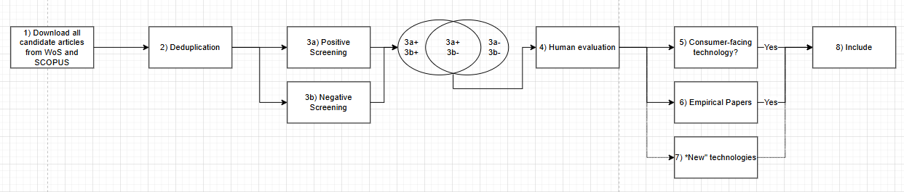

# Overview 

## WHY do we do this project? 

With this project, our primary aim is to contribute to **resolving the jingle-jangle fallacy** [@wulffSemanticEmbeddingsReveal2025] in the domain of consumer-technology-interaction in marketing and consumer-behavior research. We aim to provide an **overview over the technologies that have been studied**, their **essence**, and the extent towards which these essences and technologies overlap or diverge, and what implications this should have for the understanding of our field and future research.

This project is aimed at the community of researchers in the consumer-technology domain. 

## WHAT do we do? 

1. Identify technologies studied in consumer-technology research since 2000. 
2. Identify postulated consequences / essences of these technologies. 
3. Create a semantic map of technologies using embedding models and bibliometric analysis [@wulffSemanticEmbeddingsReveal2025;@ariaBibliometrixRtoolComprehensive2017;@donthuHowConductBibliometric2021]
4. Integrate the technology-essence dimension into a multi-dimensional map

# Data 

## Inclusion and Exclusion {.smaller}

$\rightarrow$ Bottom-up assessing of technologies based on *all articles published since 2000* in the following journals: 

- *Journal of Marketing*
- *Journal of Consumer Behavior*
- *Journal of Consumer Psychology*
- *Journal of the Academy of Marketing Science*
- *Journal of Marketing Research*
- *International Journal of Research in Marketing*
- *Marketing Science*

## Inclusion Criteria 

1. Discusses a **technology**
2. Discusses a **consumer-facing technology** 
3. Discusses on an **empirical basis**

## Inclusion Criteria

1. Discusses a **technology**

Definition *Technology*: 

"scientific knowledge and/or its application for firms and/or consumers with the potential to influence the activity, institutions, and processes for creating, communicating, delivering, and exchanging offerings that have value for customers, clients, partners, and society at large." [@hoffmanRiseNewTechnologies2022, p.2]

## Inclusion Criteria

2. Discusses a **consumer-facing technology** 

Definition *Consumer-facing Technology*: 

"A consumer-facing technology is a technology that consumers / end users directly interact with or directly experience."

## Inclusion Criteria

3. Discusses on an **empirical basis**

Definition *Empirical*: 

"An empirical article reports research that is based on observation and measurement of phenomena." [@veraLibraryGuidesEmpirical]

## Extraction Pipeline

# Dimensions of Analysis 

## Method of Identification

- Identification through bottom-up and top-down processing + human verification 
- Modelling through semantic embedding (`mp...`), dimensionality reduction (UMAP, $d = 10, dist = 0$), and subsequent k-means clustering
    - N° Clusters evaluated: 10,15,20,25,30
- Label with LLM

## Technology — k = 10

<iframe src="../images/Figures_CTM/technology/technology_map_k10.html" width="100%" height="620px"></iframe>

<small>Technology clusters based on k-means clustering. Map coordinates are based on UMAP dimensionality reduction with cosine distance, two components, min_dist = 0.05, and dynamic n_neighbors = min(15, N − 1). Coordinates are used only for visualization.</small>

## Technology — k = 15

<iframe src="../images/Figures_CTM/technology/technology_map_k15.html" width="100%" height="620px"></iframe>

<small>Technology clusters based on k-means clustering. Map coordinates are based on UMAP dimensionality reduction with cosine distance, two components, min_dist = 0.05, and dynamic n_neighbors = min(15, N − 1). Coordinates are used only for visualization.</small>

## Technology — k = 20

<iframe src="../images/Figures_CTM/technology/technology_map_k20.html" width="100%" height="620px"></iframe>

<small>Technology clusters based on k-means clustering. Map coordinates are based on UMAP dimensionality reduction with cosine distance, two components, min_dist = 0.05, and dynamic n_neighbors = min(15, N − 1). Coordinates are used only for visualization.</small>

## Technology — k = 25

<iframe src="../images/Figures_CTM/technology/technology_map_k25.html" width="100%" height="620px"></iframe>

<small>Technology clusters based on k-means clustering. Map coordinates are based on UMAP dimensionality reduction with cosine distance, two components, min_dist = 0.05, and dynamic n_neighbors = min(15, N − 1). Coordinates are used only for visualization.</small>

## Technology — k = 30

<iframe src="../images/Figures_CTM/technology/technology_map_k30.html" width="100%" height="620px"></iframe>

<small>Technology clusters based on k-means clustering. Map coordinates are based on UMAP dimensionality reduction with cosine distance, two components, min_dist = 0.05, and dynamic n_neighbors = min(15, N − 1). Coordinates are used only for visualization.</small>

## Mechanism — k = 10

<iframe src="../images/Figures_CTM/mechanism/mechanism_map_k10.html" width="100%" height="620px"></iframe>

<small>Mechanism clusters based on k-means clustering. Map coordinates are based on UMAP dimensionality reduction with cosine distance, two components, min_dist = 0.05, and dynamic n_neighbors = min(15, N − 1). Coordinates are used only for visualization.</small>

## Mechanism — k = 15

<iframe src="../images/Figures_CTM/mechanism/mechanism_map_k15.html" width="100%" height="620px"></iframe>

<small>Mechanism clusters based on k-means clustering. Map coordinates are based on UMAP dimensionality reduction with cosine distance, two components, min_dist = 0.05, and dynamic n_neighbors = min(15, N − 1). Coordinates are used only for visualization.</small>

## Mechanism — k = 20

<iframe src="../images/Figures_CTM/mechanism/mechanism_map_k20.html" width="100%" height="620px"></iframe>

<small>Mechanism clusters based on k-means clustering. Map coordinates are based on UMAP dimensionality reduction with cosine distance, two components, min_dist = 0.05, and dynamic n_neighbors = min(15, N − 1). Coordinates are used only for visualization.</small>

## Mechanism — k = 25

<iframe src="../images/Figures_CTM/mechanism/mechanism_map_k25.html" width="100%" height="620px"></iframe>

<small>Mechanism clusters based on k-means clustering. Map coordinates are based on UMAP dimensionality reduction with cosine distance, two components, min_dist = 0.05, and dynamic n_neighbors = min(15, N − 1). Coordinates are used only for visualization.</small>

## Mechanism — k = 30

<iframe src="../images/Figures_CTM/mechanism/mechanism_map_k30.html" width="100%" height="620px"></iframe>

<small>Mechanism clusters based on k-means clustering. Map coordinates are based on UMAP dimensionality reduction with cosine distance, two components, min_dist = 0.05, and dynamic n_neighbors = min(15, N − 1). Coordinates are used only for visualization.</small>

## Essence — k = 10

<iframe src="../images/Figures_CTM/essence/essence_map_k10.html" width="100%" height="620px"></iframe>

<small>Essence clusters based on k-means clustering. Map coordinates are based on UMAP dimensionality reduction with cosine distance, two components, min_dist = 0.05, and dynamic n_neighbors = min(15, N − 1). Coordinates are used only for visualization.</small>

## Essence — k = 15

<iframe src="../images/Figures_CTM/essence/essence_map_k15.html" width="100%" height="620px"></iframe>

<small>Essence clusters based on k-means clustering. Map coordinates are based on UMAP dimensionality reduction with cosine distance, two components, min_dist = 0.05, and dynamic n_neighbors = min(15, N − 1). Coordinates are used only for visualization.</small>

## Essence — k = 20

<iframe src="../images/Figures_CTM/essence/essence_map_k20.html" width="100%" height="620px"></iframe>

<small>Essence clusters based on k-means clustering. Map coordinates are based on UMAP dimensionality reduction with cosine distance, two components, min_dist = 0.05, and dynamic n_neighbors = min(15, N − 1). Coordinates are used only for visualization.</small>

## Essence — k = 25

<iframe src="../images/Figures_CTM/essence/essence_map_k25.html" width="100%" height="620px"></iframe>

<small>Essence clusters based on k-means clustering. Map coordinates are based on UMAP dimensionality reduction with cosine distance, two components, min_dist = 0.05, and dynamic n_neighbors = min(15, N − 1). Coordinates are used only for visualization.</small>

## Essence — k = 30

<iframe src="../images/Figures_CTM/essence/essence_map_k30.html" width="100%" height="620px"></iframe>

<small>Essence clusters based on k-means clustering. Map coordinates are based on UMAP dimensionality reduction with cosine distance, two components, min_dist = 0.05, and dynamic n_neighbors = min(15, N − 1). Coordinates are used only for visualization.</small>
 
