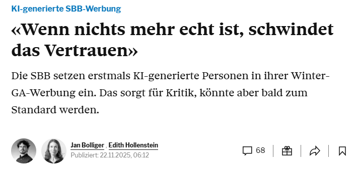
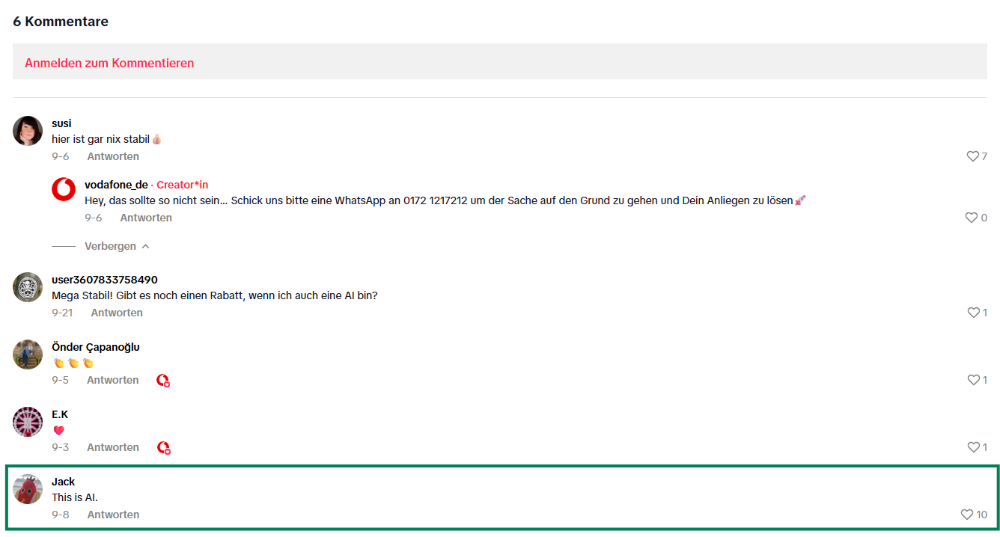

## Agenda
### Part 1 (~ 45 min)
- Origin Ambiguity in Online Materials
- Phenomenon representation in real life
- Ideas and Plans
- Open Discussion points

### Part 2 (~ 15 min)
- Open Science sais hi! 

:::{.section-header-bg}
# Origin Ambiguity
:::{.authors-p}
Sabou Rani Stocker, Jonas Görgen, Emanuel de Bellis & Anne-Kathrin Kleese
:::
:::

## Real or AI?

::: {.r-stack}
{width="400"}

{.fragment width="350"}

{.fragment width="350"}
:::

:::{.source-p-blue}
source: [RealstrangeAI](https://www.instagram.com/reel/DP998AIjUqS/?utm_source=ig_web_copy_link) 
:::

## Real or AI?

::: {.r-stack}
{width="900"}

{.fragment width="500"}

:::

:::{.source-p-blue}
source: [Tagesanzeiger](https://www.tagesanzeiger.ch/sbb-werben-mit-ki-bild-fotografen-kritisieren-winterkampagne-660469800566) 
:::

## Real or AI?

::: {.r-stack}
{width="450"}

{.fragment width="900"}

:::

:::{.source-p-blue}
source: [Vodaphone](https://www.tiktok.com/@vodafonedeutschland/video/7543534062514818326) 
:::

:::{.quote-slide-bg}
##
Today's AI is the worst AI you will ever use.

:::{.source-p}
Ethan Mollick ([LinkedIn](https://www.linkedin.com/posts/emollick_todays-ai-is-the-worst-ai-you-will-ever-activity-7106305750431322112-Xr7n?utm_source=share&utm_medium=member_desktop&rcm=ACoAADFA1dwBsHPjTu6xag-1tBYDcJm6WYeFn78))
:::
:::

:::{.notes}
**Ethan Mollick**: https://mgmt.wharton.upenn.edu/profile/emollick/ His academic research has been published in leading journals, and his work on AI is widely applied, leading him to be named one of TIME Magazine’s Most Influential People in Artificial Intelligence. Ethan also writes to a wider audience about AI, including in his book, Co-Intelligence, which was a New York Times bestseller and a best book of the year from The Economist and Financial Times.
:::

## And people are already bad at identifying AI-generated materials

- “**almost 50% of respondents can distinguish between AI and human** generated artwork.” [@vukojicicImitationDrawingCan2023]
- “participants **performed below chance levels** in identifying AI-generated poems (46.6% accuracy)" [@porterAIgeneratedPoetryIndistinguishable2024a]
- “participants were more likely to judge AI-generated poems as human-authored than actual human-authored poems [@porterAIgeneratedPoetryIndistinguishable2024a]
- With training, participants were able to correctly **identify AI generated text correctly 65% of the time**; without training 55% [@milickaHumansCanLearn2025]

## What do we know?
- what happens when use of AI **is** disclosed? 
  - aversion (algorithm aversion, ...)
- ambiguity effects in marketing
  - justify motivation
  - justify authenticity

## A Field of Tension

## Downstream Effects
1. Cognitive Resources
2. Trust, Willingness to Pay, and Willingness to Recommend
3. 

## QUESTION 1
- 

## Important Questions to Adress
### Can we find this effect in real life? 
-> ESF-survey

# References