## Overview {.blue-slide-bg .center}

:::{.white-text-p}
1. Background and Framing
2. "Mapping a Field"
3. Towards a Map of Consumers and Technology
4. Questions & Inputs
:::

# Background and Framing {.section-header-bg}

## Consumers + Technology Dialogue

:::: image-center-stack
::: {.r-stack style="height: 70vh; display: flex; align-items: center; justify-content: center;"}
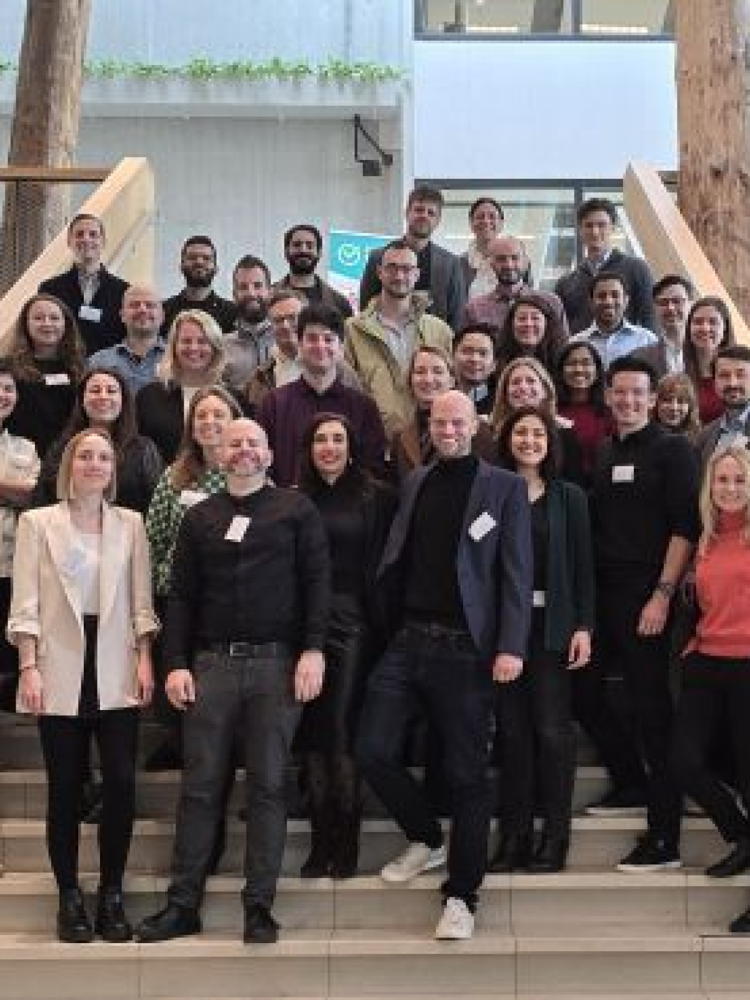{.fragment width="70%"  }

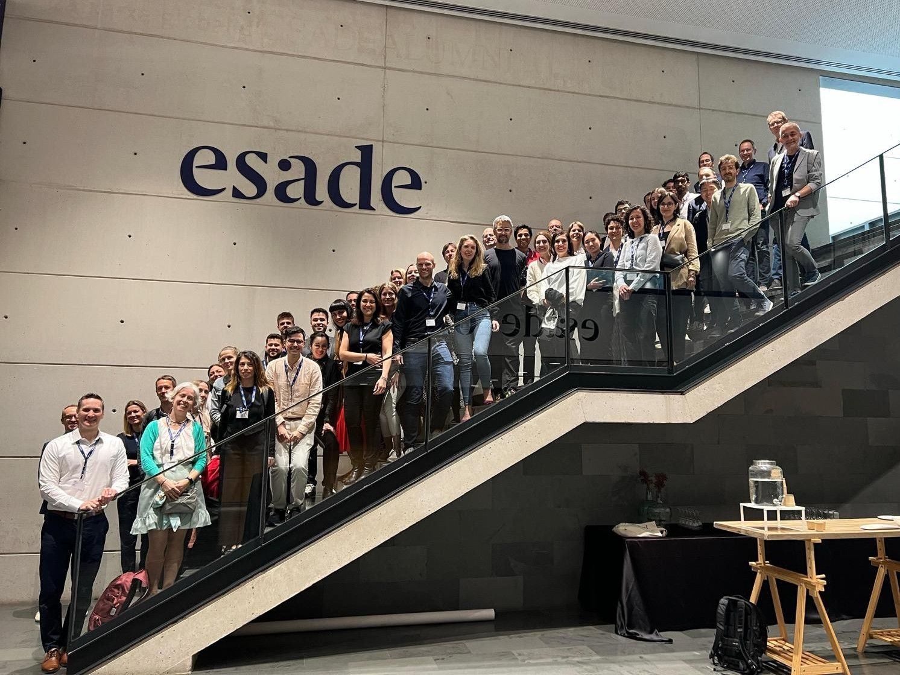{.fragment width="70%"}

{.fragment width="70%"}
:::
::::

:::{.notes}
- some background on the presentation today: 
  - consumers + technology dialogue 2026 (3rd edition!) is happening in June this year
  - came up with the idea that we could start the event by creating a map of what our field has produced so far
  - wondered if we shouldn't try to make a proper project out of it 
- some possible outlets we discussed
- that discussion essentially started last week, so this is where we are right now, and what I am going to talk to you about
:::

## Consumers + Technology Dialogue

:::: image-center-stack
::: {.r-stack style="height: 70vh; display: flex; align-items: center; justify-content: center;"}
{width="70%" style="opacity: 0.5;"}

{style="opacity: 0.5; "width="70%"}

{style="opacity: 0.5;" width="70%"}

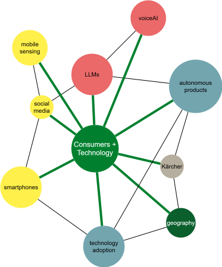{.absolute .fade-in bottom="0" left="200" width="650"}

{.absolute .fragment .fade-in bottom="20" left="200" width="650"}
:::
::::

## Timeline

```{mermaid}
%%| echo: false
%%{init: {
  "theme": "base",
  "themeVariables": {
    "fontFamily": "Inter, Arial, sans-serif",
    "background": "#ffffff",
    "mainBkg": "#ffffff",
    "textColor": "#1f2937",
    "titleColor": "#0a5f2d",

    "primaryColor": "#00802f",
    "primaryTextColor": "#ffffff",
    "primaryBorderColor": "#0a5f2d",

    "lineColor": "#0a5f2d",
    "gridColor": "#d9e7df",

    "sectionBkgColor": "#eef7f1",
    "sectionBkgColor2": "#f7fafb",
    "altSectionBkgColor": "#f7fafb",

    "taskBkgColor": "#73a5af",
    "taskBorderColor": "#0a5f2d",
    "taskTextColor": "#102027",
    "taskTextOutsideColor": "#102027",

    "activeTaskBkgColor": "#00802f",
    "activeTaskBorderColor": "#0a5f2d",

    "doneTaskBkgColor": "#cfe8d9",
    "doneTaskBorderColor": "#0a5f2d",

    "critBkgColor": "#eb6969",
    "critBorderColor": "#0a5f2d",

    "todayLineColor": "#eb6969"
  }
}}%%

gantt
    dateFormat  YYYY-MM-DD
    axisFormat  %d.%m.%Y

    section Preparation CTD26
    First data collection                   :done, a1, 2026-05-01, 2026-05-08
    Preliminary analysis                    :active, a2, after a1, 2026-05-15
    Presentation in Colloquium              :milestone, m0, 2026-05-13, 0d
    First dissemination                     :active, a3, after a2, 2026-05-21
    Discussion and revisions                :a4, after a3, 2026-05-30
    Preparation results and presentation    :a5, after a4, 2026-06-10

    section Consumers + Technology Dialogue 2026
    CTD26                                   :crit, b1, 2026-06-23, 2026-06-26
    Presentation at CTD                            :milestone, m1, 2026-06-24, 0d

    section Preparation Manuscript
    Further analyses based on CTD input           :c1, 2026-07-01, 10d
    Writing of manuscript                   :c2, after c1, 2026-07-20
    Feedback v1 manuscript                  :c3, after c2, 2026-07-31
    Revision of manuscript                  :c4, after c3, 2026-08-14
    Further revision rounds                  :c5, after c4, 2026-08-30
    Submission manuscript                   :milestone, m3, 2026-08-31, 0d

    section Finalization
    Aftermath (?)                               :d1, 2026-09-01, 2026-09-30
```

## Goal of Today's Colloqium{.center}

-   What would make a field map **useful** to you?
-   What **dimensions** matter most in mapping *consumers and technology*?
-   **Methodological** opportunities and pitfalls?

# "Mapping a Field" {.section-header-bg}

## Established in the Literature

::::: columns
::: {.column width="38%"}
<div  style="border: 2px solid #444; background: #73a5af; color:white;border-radius: 12px; padding: 20px; text-align: center;font-size:0.7em;margin-bottom:5px;">
SLR & taxonomies
</div>
<div style="border: 2px solid #444; background: #73a5af; color:white;border-radius: 12px; padding: 20px; text-align: center;font-size:0.7em;margin-bottom:5px;">
Bibliometric analysis
</div>
<div style="border: 2px solid #444; background: #73a5af; color:white;border-radius: 12px; padding: 20px; text-align: center;font-size:0.7em;margin-bottom:5px;">
Topic modelling
</div>
<div style="border: 2px solid #444; background: #73a5af; color:white;border-radius: 12px; padding: 20px; text-align: center;font-size:0.7em;margin-bottom:5px;">
Generative LLMs
</div>
:::

::: {.column width="58%"}
{width="60%" style="display: block; margin: auto;align: center;"}
:::
:::::

## Established in the Literature

::::: columns
::: {.column width="38%"}
<div  style="border: 2px solid #444; background: #00802f; color:white;border-radius: 12px; padding: 20px; text-align: center;font-size:0.7em;margin-bottom:5px;">
SLR & taxonomies
</div>
<div style="border: 2px solid #444; background: #73a5af; color:white;border-radius: 12px; padding: 20px; text-align: center;font-size:0.7em;margin-bottom:5px;">
Bibliometric analysis
</div>
<div style="border: 2px solid #444; background: #73a5af; color:white;border-radius: 12px; padding: 20px; text-align: center;font-size:0.7em;margin-bottom:5px;">
Topic modelling
</div>
<div style="border: 2px solid #444; background: #73a5af; color:white;border-radius: 12px; padding: 20px; text-align: center;font-size:0.7em;margin-bottom:5px;">
Generative LLMs
</div>
:::

::: {.column width="58%"}
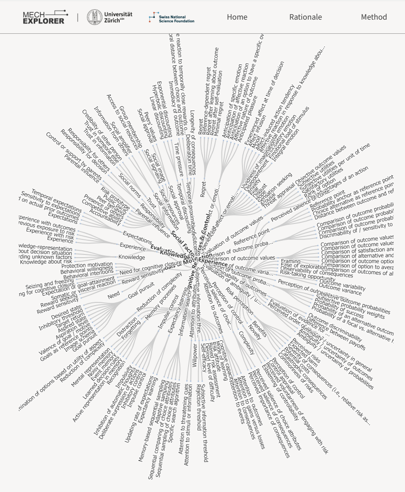{style="max-width: 60%; max-height: 60vh; display: block; margin: auto;"}

:::{.bib-p}
A Taxonomy of State-Specific Psychological Mechanisms Underlying Decisions Under Risk and Uncertainty [@lobTaxonomyStateSpecificPsychological2025]

Method papers: @nickersonMethodTaxonomyDevelopment2013, and others
:::

:::
:::::

## Established in the Literature

:::::: columns
::: {.column width="38%"}
<div  style="border: 2px solid #444; background: #73a5af; color:white;border-radius: 12px; padding: 20px; text-align: center;font-size:0.7em;margin-bottom:5px;">
SLR & taxonomies
</div>
<div style="border: 2px solid #444; background: #00802f; color:white;border-radius: 12px; padding: 20px; text-align: center;font-size:0.7em;margin-bottom:5px;">
Bibliometric analysis
</div>
<div style="border: 2px solid #444; background: #73a5af; color:white;border-radius: 12px; padding: 20px; text-align: center;font-size:0.7em;margin-bottom:5px;">
Topic modelling
</div>
<div style="border: 2px solid #444; background: #73a5af; color:white;border-radius: 12px; padding: 20px; text-align: center;font-size:0.7em;margin-bottom:5px;">
Generative LLMs
</div>
:::

:::: {.column width="58%"}
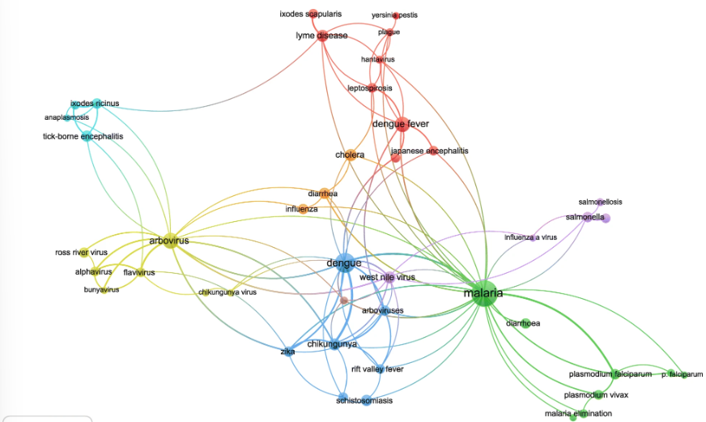{style="max-width: 90%; max-height: 80vh; display: block; margin: auto;"}

:::{.bib-p}
Bibliometric analysis of peer-reviewed literature on climate change and human health with an emphasis on infectious diseases [@sweilehBibliometricAnalysisPeerreviewed2020]

Method papers: @ariaBibliometrixRtoolComprehensive2017, @donthuHowConductBibliometric2021
:::
::::
::::::

## Established in the Literature

::::: columns
::: {.column width="38%"}
<div  style="border: 2px solid #444; background: #73a5af; color:white;border-radius: 12px; padding: 20px; text-align: center;font-size:0.7em;margin-bottom:5px;">
SLR & taxonomies
</div>
<div style="border: 2px solid #444; background: #73a5af; color:white;border-radius: 12px; padding: 20px; text-align: center;font-size:0.7em;margin-bottom:5px;">
Bibliometric analysis
</div>
<div style="border: 2px solid #444; background: #00802f; color:white;border-radius: 12px; padding: 20px; text-align: center;font-size:0.7em;margin-bottom:5px;">
Topic modelling
</div>
<div style="border: 2px solid #444; background: #73a5af; color:white;border-radius: 12px; padding: 20px; text-align: center;font-size:0.7em;margin-bottom:5px;">
Generative LLMs
</div>
:::

::: {.column width="58%"}
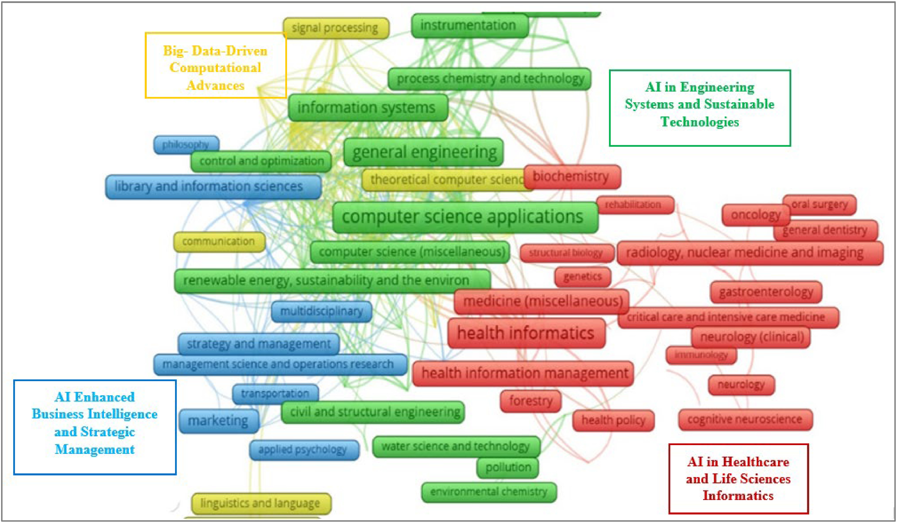{style="max-width: 90%; max-height: 80vh; display: block; margin: auto;"}

:::{.bib-p}
Unveiling the dynamics of AI applications: A review of reviews using scientometrics and BERTopic modeling [@ramanUnveilingDynamicsAI2024]

Method papers: @grootendorstBERTopicNeuralTopic2022
:::
:::
:::::

## Established in the Literature

:::::: columns
::: {.column width="38%"}
<div  style="border: 2px solid #444; background: #73a5af; color:white;border-radius: 12px; padding: 20px; text-align: center;font-size:0.7em;margin-bottom:5px;">
SLR & taxonomies
</div>
<div style="border: 2px solid #444; background: #73a5af; color:white;border-radius: 12px; padding: 20px; text-align: center;font-size:0.7em;margin-bottom:5px;">
Bibliometric analysis
</div>
<div style="border: 2px solid #444; background: #73a5af; color:white;border-radius: 12px; padding: 20px; text-align: center;font-size:0.7em;margin-bottom:5px;">
Topic modelling
</div>
<div style="border: 2px solid #444; background: #00802f; color:white;border-radius: 12px; padding: 20px; text-align: center;font-size:0.7em;margin-bottom:5px;">
Generative LLMs
</div>
:::

:::: {.column width="58%"}
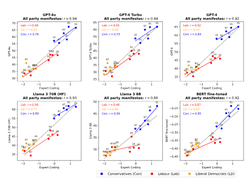{style="max-width: 90%; max-height: 80vh; display: block; margin: auto;"}

::: bib-p
Positioning Political Texts with Large Language Models by Asking and Averaging [@lemensPositioningPoliticalTexts2025]

Method papers: @wangPromptingLargeLanguage2023,@liuLLMGuidedSemanticAwareClustering,@muLargeLanguageModels
:::
::::
::::::

## Advantages and Disadvantages {.smaller}

<style>
.reveal section .comparison-table {
  font-size: 0.8em;
  width: 100%;
  table-layout: fixed;
}

.reveal section .comparison-table th,
.reveal section .comparison-table td {
  vertical-align: top;
  padding: 0.45em;
  line-height: 1.25;
}

.reveal section .comparison-table th {
  text-align: center;
}

.reveal section .comparison-table td:first-child {
  font-weight: bold;
  width: 13%;
}

.reveal section .comparison-table ul {
  margin: 0;
  padding-left: 1.1em;
}
</style>

<table class="comparison-table">
  <thead>
    <tr>
      <th></th>
      <th>SLR</th>
      <th>Bibliometric</th>
      <th>Topic Modelling</th>
      <th>Gen LLMs</th>
    </tr>
  </thead>

  <tbody>
    <tr>
      <td>Advantages</td>
      <td>
        <ul>
          <li>Deep embedding of expert knowledge possible</li>
        </ul>
      </td>
      <td>
        <ul>
          <li>Covers very broad scope</li>
        </ul>
      </td>
      <td>
        <ul>
          <li>Covers very broad scope</li>
          <li>Contextual understanding</li>
        </ul>
      </td>
      <td>
        <ul>
          <li>Additional context can be introduced through prompting</li>
        </ul>
      </td>
    </tr>

    <tr>
      <td>Disadvantages</td>
      <td>
        <ul>
          <li>Time-intensive</li>
        </ul>
      </td>
      <td>
        <ul>
          <li>No contextual understanding</li>
          <li>High-level coverage</li>
        </ul>
      </td>
      <td>
        <ul>
          <li>Preprocessing is crucial</li>
          <li>Topic interpretation can be opaque</li>
        </ul>
      </td>
      <td>
        <ul>
          <li>Topics cannot easily be positioned in relation to each other</li>
          <li>Replicability and reproducibility need to be ensured</li>
        </ul>
      </td>
    </tr>
  </tbody>
</table>

. . . 

<div style="border: 2px solid #1a8b43ff; background: #00802f; color:white;border-radius: 12px; padding: 10px;font-size:0.7em;margin-bottom:5px;">

$\Rightarrow$ Combination of several approaches may be necessary
</div>

# Towards a Map of Consumers+Technology {.section-header-bg}

## {.quote-slide-bg}

<small>My vision:</small>

"A computational bibliometric and semantic content analysis of consumer-technology-(interaction) research."

## *Who* do we Map?

- Journals from the **FT50** list
- Systematic search inputs: `consum* AND technolog*` / `human AND technolog*` / `technolog* AND interact*` / `technolog*` ... 
- Further inclusion criteria: research domain? Impact (citations)? ... 

. . . 

<div style="border: 2px solid #b86868ff; background: #eb6969; color:white;border-radius: 12px; padding: 20px;font-size:0.7em;margin-bottom:5px;">

$\rightarrow$ False positives vs. false negatives?

$\rightarrow$ What inclusion and exclusion criteria did we miss?

</div>

## *What* do we Map?

<div style="display:grid; grid-template-columns:repeat(3, 1fr); gap:18px; margin-top:1em; margin-bottom:1.4em;">

<div class="fragment" data-fragment-index="1" style="border:1.5px solid #ddd; border-radius:14px; padding:18px; background:white;">
<strong>Foundational work</strong><br>
<span style="font-size:0.7em;">Key papers, theories, and concepts.</span>
</div>

<div class="fragment" data-fragment-index="2" style="border:1.5px solid #ddd; border-radius:14px; padding:18px; background:white;">
<strong>Content maps</strong><br>
<span style="font-size:0.7em;">Topics, themes, and research areas.</span>
</div>

<div class="fragment" data-fragment-index="3" style="border:1.5px solid #ddd; border-radius:14px; padding:18px; background:white;">
<strong>Relationships</strong><br>
<span style="font-size:0.7em;">Links, clusters, conceptual overlap and divergence.</span>
</div>

</div>

. . .

<div style="border: 2px solid #b86868ff; background: #eb6969; color:white;border-radius: 12px; padding: 20px;font-size:0.7em;margin-bottom:5px;">

$\rightarrow$ What is of interest to you? To the community?

$\rightarrow$ Which methodologies are promising?

$\rightarrow$ What worries you about the content and/or the methods?
</div>

## Foundational Work
### Co-Citation Networks

$\Rightarrow$ Papers that are cited together frequently also form foundational paper for some literature traditions / content clusters [@donthuHowConductBibliometric2021]

### Most Cited Papers

$\Rightarrow$ Can show the milestone moments within (and beyond) a discipline

## Foundational Work{.image-slide-bg}
### Co-Citation Networks
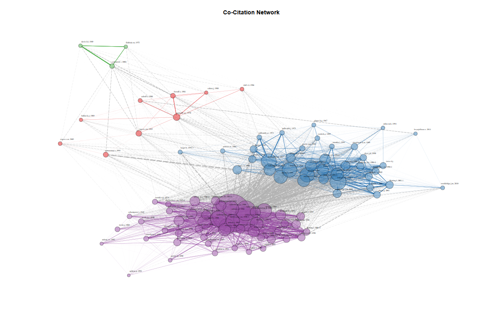{fig-align="center" width="80%"}

:::{.bib-p}
Top 100 co-cited references for all FT50 journal papers containing *technolo\** in title, abstract or keywords. IGRAPH clustering walktrap, groups: 4, mod: 0.12. Fruchterman–Reingold layout algorithm used to position nodes in a network plot. Visualization done with `bibliometrix` package [@ariaBibliometrixRtoolComprehensive2017].
:::

## Foundational Work{.image-slide-bg}
### Co-Citation Networks
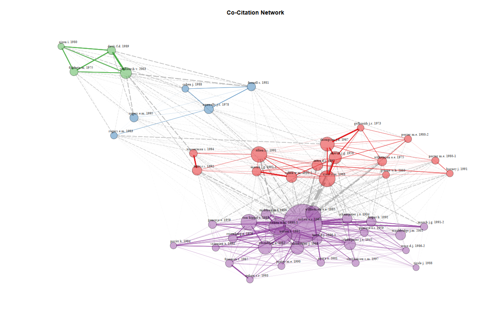{fig-align="center" width="80%"}

:::{.bib-p}
Top 100 co-cited references for select FT50 journal papers containing *technolo\** in title, abstract or keywords. IGRAPH clustering walktrap, groups: 4, mod: 0.16. Fruchterman–Reingold layout algorithm used to position nodes in a network plot. Visualization done with `bibliometrix` package [@ariaBibliometrixRtoolComprehensive2017].
:::


:::{.notes}
the nodes are cited references, not necessarily the papers in your original dataset. So the clusters show which cited references are co-cited together.
patial distance is useful visually, but not a direct statistical measure. The edges, edge weights, and clusters are the actual data; the Fruchterman layout is just a readable arrangement of those data that has quite strong attractions vs. repellents. 

size of the node = frequency 
location = centrality, A reference with high degree is co-cited with many other references.
edges = cocitation strength
:::

## Foundational Papers{.image-slide-bg}
### Most Cited Papers

:::: {.columns}

::: {.column width="50%"}
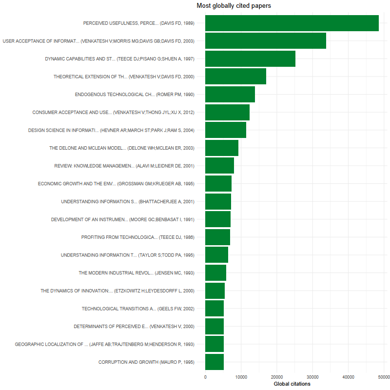{fig-align="center" width="80%"}

:::{.bib-p}
FT50 journal papers containing *technolo\** in title, abstract or keywords. Database: Scopus.
:::
:::

::: {.column width="50%"}
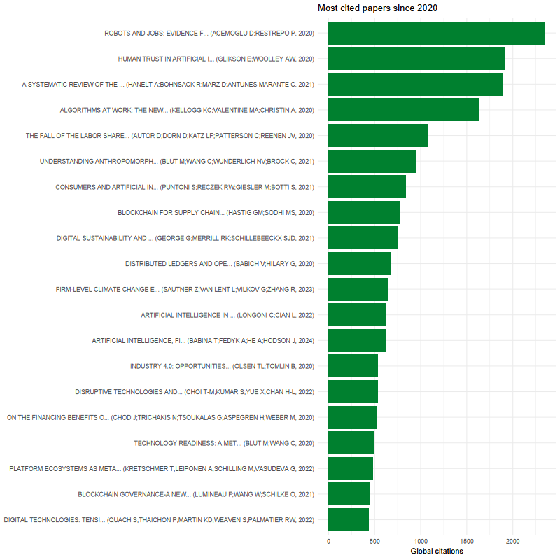{fig-align="center" width="80%"}

:::{.bib-p}
FT50 journal papers containing *technolo\** in title, abstract or keywords since 2020. Database: Scopus.
:::
:::

::::

## Topics{.smaller}
### Term frequencies and co-occurrences
$\Rightarrow$ Keyword co-occurence and strenght of this co-occurence can indicate both level of maturity of a research stream, and connectedness to other research streams [@donthuHowConductBibliometric2021;@coboApproachDetectingQuantifying2011]

### Semantic topic models
$\Rightarrow$ Embedding-based models for improved context-awareness [@grootendorstBERTopicNeuralTopic2022]

### LLM augmented models
$\Rightarrow$ LLM-based preprocessing to identify meaningful dimensions

::: {.fragment .fade-in}
<div style="border: 2px solid #b86868ff; background: #eb6969; color:white;border-radius: 12px; padding: 20px;font-size:0.7em;margin-bottom:5px;">
$\rightarrow$ Are the clusters meaningful?

$\rightarrow$ Is the method replicable and reproducible?
</div>
:::

:::{.notes}
LDA = latent dirichlet allocation
STM = structured topic modelling = LDA with extra steps
:::

## Topics{.image-slide-bg}
### Term frequencies and co-occurences

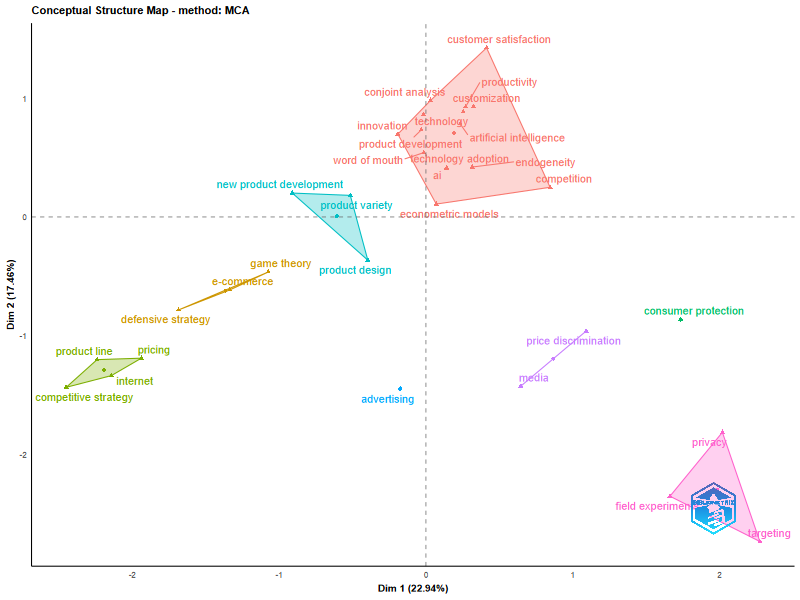{fig-align="center" width="80%"}

:::{.bib-p}
Content model of author keywords from select FT50 journal papers containing *technolo\** in title, abstract or keywords. Clustering based on multiple correspondence analysis, reduction two-dimensional factorial space. Percentages display total variation (inertia) in document-keyword matrix. Visualization done with `bibliometrix` package [@ariaBibliometrixRtoolComprehensive2017].
:::

::::{.notes}
MCA = dimensionality reduction for categorical words
Binary (PRESENT VS ABSENT) -> basically a confirmatory factor analysis with 2 factors 

inertia = how much of the overall structure in the document–keyword matrix is represented by each axis, very similar to explained variance
:::

## Topics{.image-slide-bg}
### Term frequencies and co-occurences

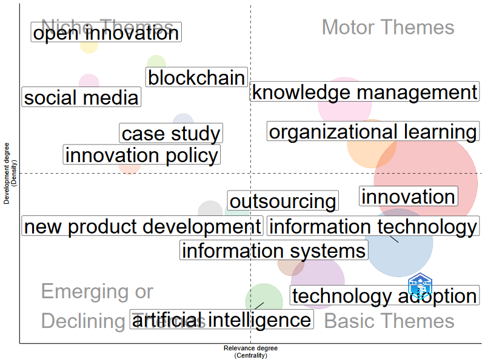{fig-align="center" width="80%"}

:::{.bib-p}
Content model of author keywords from select FT50 journal papers containing *technolo\** in title, abstract or keywords, keywords grouped into clusters based on co-occurence using Louvain clustering, after @coboApproachDetectingQuantifying2011. Clusters are plotted on centrality and density dimension, scales are ordinal. Visualization done with `bibliometrix` package [@ariaBibliometrixRtoolComprehensive2017].
:::

:::{.notes}

The co-occurrences are counted by building a document–keyword incidence matrix and projecting it into a keyword–keyword co-occurrence matrix. The themes are then determined by clustering that weighted keyword network, usually with Louvain.

It matters how often keywords appear in a paper, documents matter

- centrality = strength to other clusters
- density = internal cohesion 
:::

## Topics {.image-slide-bg}

### Term frequencies and co-occurrences

<div style="text-align: center;">
  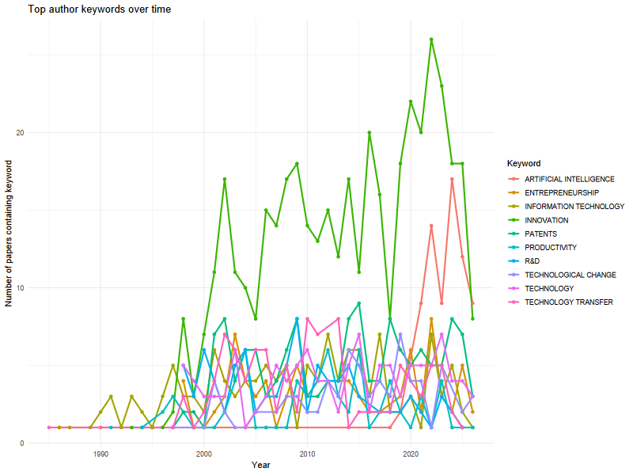
</div>

:::{.bib-p}
Most frequently used author keywords from select FT50 journal papers containing *technolo\** in title, abstract or keywords. Own visualization.
:::

:::{.fragment .fade-in-then-out}
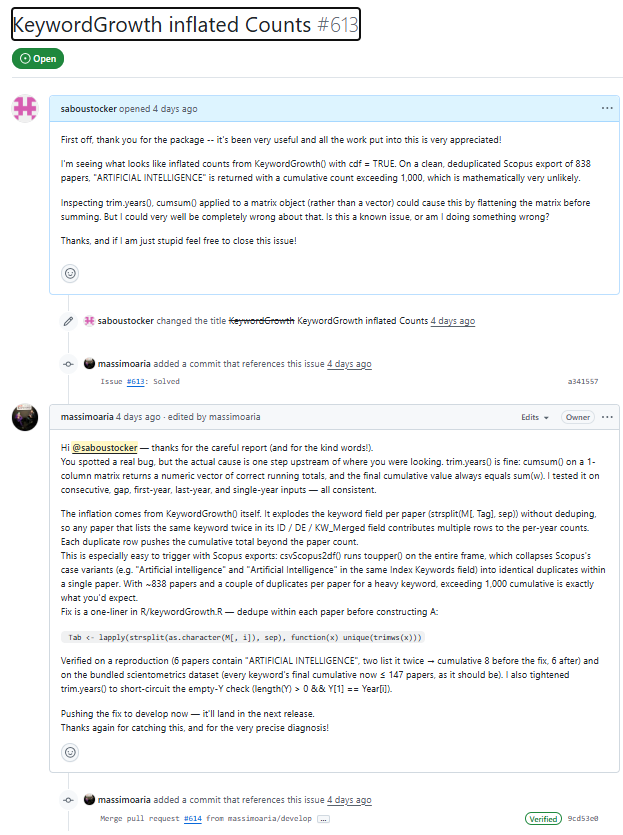
:::

::::{.notes}
MCA = dimensionality reduction for categorical words
Binary (PRESENT VS ABSENT) -> basically a confirmatory factor analysis with 2 factors 

inertia = how much of the overall structure in the document–keyword matrix is represented by each axis, very similar to explained variance
:::

## Topics{.image-slide-bg}
### Embedding-based Models

<iframe 
  class="plotly-frame r-stretch"
  src="../images/bertopic_keyword_map.html"
  loading="lazy"
></iframe>

:::{.bib-p}
Intertopic Distance map of titles + keywords from select FT50 journal papers containing *technolo\** in title, abstract or keywords. BERTopic embeddings with `BAAI/bge-small-en-v1.5`, UMAP with cosine distance metrics, n_neighbors = 5 and n_components = 5. Own visualization with `plotly`. Topic titles are LLM generated (OpenAI ChatGPT-4o-mini, t = 0).
:::

## Topics{.image-slide-bg}
### LLM augmented models

<iframe 
  class="plotly-frame r-stretch"
  src="../images/LLM_bertopic_combo_map.html"
  loading="lazy"
></iframe>

:::{.bib-p}
Intertopic Distance map of LLM-extracted technology–change–consequence combinations from select FT50 journal papers containing technolo* in title, abstract or keywords. BERTopic embeddings with BAAI/bge-small-en-v1.5, UMAP with cosine distance metric, n_neighbors = 15 and n_components = 5. Technology, change, and consequence codes are LLM generated from abstracts (OpenAI ChatGPT-4o-mini, t = 0). Topic titles are LLM generated (OpenAI ChatGPT-4o-mini, t = 0). Own visualization with `plotly`.
:::

## Topics{.image-slide-bg}
### LLM augmented models

  <iframe 
    class="plotly-frame r-stretch"
    src="../images/LLM_bertopic_combo_document_map.html"
    loading="lazy">
  </iframe>


:::{.bib-p}
Intertopic Distance map of LLM-extracted technology–change–consequence combinations from select FT50 journal papers containing technolo* in title, abstract or keywords. BERTopic embeddings with `BAAI/bge-small-en-v1.5`, UMAP with cosine distance metric, n_neighbors = 15 and n_components = 5. Technology, change, and consequence codes are LLM generated from abstracts (OpenAI ChatGPT-4o-mini, t = 0). Topic titles are LLM generated (OpenAI ChatGPT-4o-mini, t = 0). Own visualization with `plotly`.
:::

## Topics{.image-slide-bg}
### LLM augmented models

  <iframe 
    class="plotly-frame r-stretch"
    src="../images/LLM_technology_consequence_3d_map.html"
    loading="lazy">
  </iframe>


:::{.bib-p}
3D semantic map of LLM-extracted technology–consequence relations from select FT50 journal papers containing technolo* in title, abstract or keywords. Separate BERTopic models cluster technologies and consequences; point positions are based on shared `BAAI/bge-small-en-v1.5` embeddings reduced with 3D UMAP. Codes and topic labels are LLM generated (OpenAI `ChatGPT-4o-mini`, t = 0). Own visualization with `plotly`.
:::

## Topics{.image-slide-bg}
### LLM augmented models

  <iframe 
    class="plotly-frame r-stretch"
    src="../images/LLM_technology_change_3d_map.html"
    loading="lazy">
  </iframe>


:::{.bib-p}
3D semantic map of LLM-extracted technology–change relations from select FT50 journal papers containing technolo* in title, abstract or keywords. Separate BERTopic models cluster technologies and changes; point positions are based on shared `BAAI/bge-small-en-v1.5` embeddings reduced with 3D UMAP. Codes and topic labels are LLM generated (OpenAI `ChatGPT-4o-mini`, t = 0). Own visualization with `plotly`.
:::


# Q&A and Sounding Board {.section-header-bg}

## Your Questions? {.center .red-slide-bg}

## My Questions {.red-slide-bg .center}

:::{.white-text-p}

1. What are we missing in the vision
2. Inclusion criteria decisions
3. Content clustering decisions
4. Replicability and Reproduceability of clustering

:::

## {.quote-slide-bg}
Thank you!
<br>
<br>
<br>
<br>
<br>
<br>
<small>
Slides: https://saboustocker.github.io/slides/slides/ctm_project.html
</small>

# Bibliography